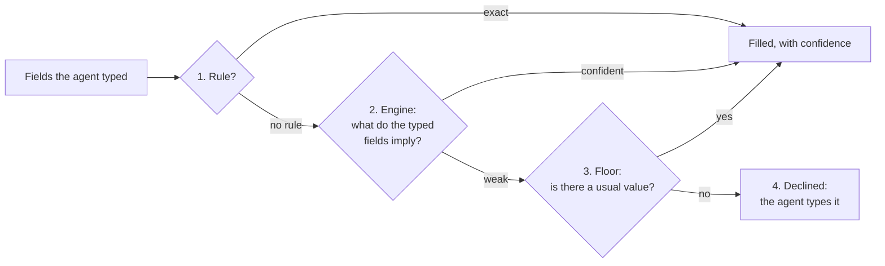
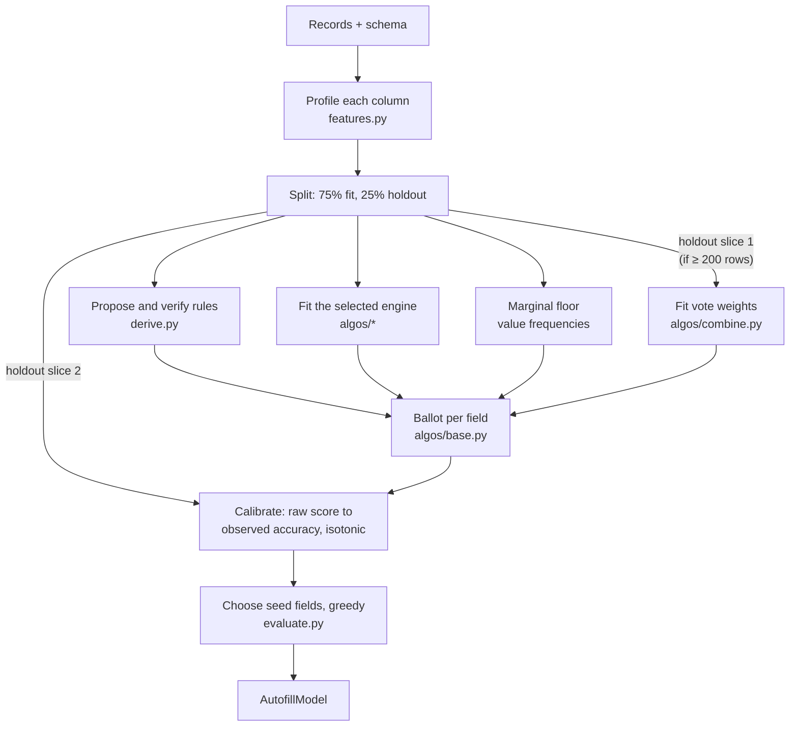

# The algorithms, and why these ones

How AIrForms learns to fill a form, why it uses the methods it does, how they
differ from better-known ones such as K-means, and which others could be
used instead. Part 1 is for anyone and assumes no maths. Part 2 is for
engineers and says exactly what the code does.

Checked against the code at version 0.15.1. The measurements were taken on
the `auto_insurance_quote` example (500 generated records, seed 42, trained
with seed 1).

**Contents**

Part 1, for everyone
1. [The problem in one example](#1-the-problem-in-one-example)
2. [What kind of problem this is, and why K-means is not the tool](#2-what-kind-of-problem-this-is-and-why-k-means-is-not-the-tool)
3. [How a prediction is made: four layers](#3-how-a-prediction-is-made-four-layers)
4. [The six engines in plain words](#4-the-six-engines-in-plain-words)
5. [How we know it works](#5-how-we-know-it-works)
6. [Why these methods and not others](#6-why-these-methods-and-not-others)
7. [Questions stakeholders ask](#7-questions-stakeholders-ask)

Part 2, for engineers

8. [The training pipeline](#8-the-training-pipeline)
9. [Each technique precisely](#9-each-technique-precisely)
10. [The other algorithms in the system](#10-the-other-algorithms-in-the-system)
11. [Alternatives worth considering](#11-alternatives-worth-considering)
12. [What we would try next](#12-what-we-would-try-next)

---

# Part 1, for everyone

## 1. The problem in one example

An agent opens a car insurance quote. They type the ZIP code where the car is
kept, `78701`. Anyone who has done this job for a while already knows the
city is Austin and the state is Texas. If they also type the coverage tier,
they probably know which liability limits usually go with it.

AIrForms learns those "if this, then probably that" relationships from past
forms, then does what the experienced agent does: fills in what follows from
what has been typed, says how sure it is, and leaves alone anything it
cannot know. A claim number or a person's first name cannot be worked out
from other fields, and the honest answer there is "you will have to type
this".

## 2. What kind of problem this is, and why K-means is not the tool

Machine learning methods fall into a few families, and the family is decided
by the question being asked, not by preference.

| Family | The question it answers | Examples | Does it fit autofill? |
|---|---|---|---|
| **Supervised learning (classification)** | "Given these known facts, what is the value of that one?" Learned from examples where the answer is known. | decision trees, random forests, naive Bayes, logistic regression, nearest neighbours | **Yes. This is the problem.** Every past form is an example where every field's answer is known. |
| Unsupervised learning (clustering) | "Which records are similar to each other?" No answer is being predicted. | **K-means**, k-modes, hierarchical clustering, DBSCAN | Not on its own. It groups records but never says what goes in a field. |
| Regression | "What number goes here?" | linear regression | Only for numeric fields, and a form's fields are mostly choices, not quantities. |
| Association rule mining | "Which values tend to appear together?" | Apriori, FP-growth | Related. It finds patterns but gives no calibrated confidence and does not choose between candidates. |
| Generative language models | "What text comes next?" | GPT, Claude | Useful when building the system, not for filling forms; see §7. |

**Why not K-means specifically.** K-means splits records into K groups by
distance: each record goes to the nearest of K centre points, and the centres
move until they settle. Three things make it the wrong tool here:

1. **It does not predict anything.** It would tell us "this form belongs to
   group 3". It would not tell us the state is TX. To get a field value we
   would still have to look inside the group and pick the commonest answer,
   and that is a (crude) supervised method bolted onto a clustering one.
2. **It needs numbers and distances.** K-means averages coordinates. A form
   is mostly categories (state, plan type, relationship), and there is no
   average of "Texas" and "Ohio". The categorical version, k-modes, exists,
   but it has the same first problem.
3. **We would have to choose K, and every field would share it.** The right
   grouping for guessing a state (by ZIP) is not the right grouping for
   guessing a deductible (by plan type). A supervised method learns a
   different relationship for each field automatically.

The nearest-records engine (§4) keeps what is useful in the clustering idea,
"find records like this one", but does it per field and per form, and turns
it into a prediction with a confidence. §11 describes the one place a
clustering step could still help.

## 3. How a prediction is made: four layers

Every field goes through the same four layers, in order, and the first one
with a good answer wins.



1. **Rules.** Some fields are exact consequences of others: a full name is
   the first and last names joined, an age is arithmetic on a date of birth,
   a "same as home address" block is a copy. A rule is proposed from what
   the fields mean, then **checked against the past forms** and kept only if
   it held on at least 90% of them.
2. **The engine.** The learned part: given the fields typed so far, what are
   the others? This is the one part that can be swapped, and there are six
   engines to choose from (§4).
3. **The floor.** What the field usually says. If 99% of forms say "US",
   that is an answer even with nothing typed. If the commonest first name
   covers 2% of forms, it is not.
4. **Decline.** When none of the above is confident enough (by default a
   calibrated 70%), the field is left empty and the agent is told why.

Declining is a feature. A wrong suggestion costs an agent more time than an
empty box, because they have to notice it and correct it, and the simulator
charges for exactly that.

## 4. The six engines in plain words

All six answer the same question in different ways. Everything around the
engine (rules, floor, measuring confidence) is shared, so a confidence of
80% means the same thing whichever engine produced it.

| Engine | In plain words | Like an agent who… | Good at | Weak at |
|---|---|---|---|---|
| **statistical** (default) | Counts how often each value of one field goes with each value of another, keeps the pairs that really help, and lets them vote. | …remembers "Austin ZIPs are Texas 94% of the time, in 213 past forms". | Explaining itself: every number can be checked by hand. Works from one typed field. | Rules that need two fields *together*. |
| **tree** (decision tree) | Asks a question about one field, then the next question depends on the answer, like a flowchart. | …thinks "is it a family policy? then is the claimant a dependent? then it's *child*". | Combinations of fields; you can read the tree. | One tree can only ask its first question first. |
| **forest** (random forest) | Grows ten slightly different trees and averages them. | …is really a committee of ten agents who each learned from a different pile of forms. | Often the most accurate, and not fussy about which fields were typed first. | Slower, and no single readable tree. |
| **nearest** (nearest records) | Keeps a sample of past forms and copies what the most similar ones said. | …thinks "this looks like the Smith claim last week; that one went like this". | Closest to how people actually work. | Keeps real rows in the model, which matters if trained on real data. |
| **bayes** (naive Bayes) | Multiplies the evidence from each field as if they were unrelated. | …counts the same clue three times when ZIP, city and state all agree. | Fast and decent at picking the right answer. | Overconfident on its own; our calibration corrects that. |
| **linear** (fitted weights) | Learns a weight for every field value, pushing toward or away from each answer. | …has a gut feeling for thousands of cities without having to list them. | Fields with thousands of distinct values, which the others have to drop. | Hardest to explain: a weight is not a count of anything. |

Which one is best depends on the form, so the tool measures instead of
guessing: `fillerai train --compare` fits all six on the same records and
reports each (§5).

## 5. How we know it works

Three habits make the numbers trustworthy.

- **It is tested on forms it never saw.** A quarter of the records are held
  back before training. The model is then asked to finish those forms from
  one, two, three, five and eight of their own fields, and its answers are
  checked.
- **"90% confident" is measured, not claimed.** On those held-back forms we
  record how often answers at each confidence level were actually right, and
  that record is what turns the model's raw score into the confidence the
  agent sees. So a stated 90% is right about 90% of the time.
- **Coverage is reported beside accuracy.** A model that fills three fields
  perfectly and refuses forty is not useful, so both numbers are always
  shown.

Here is `--compare` on the car insurance example, three fields typed:

| Engine | Fills (of the remaining fields) | Right when it fills | Has any answer |
|---|---|---|---|
| statistical | 31% | 98% | 76% |
| tree | 24% | 95% | 67% |
| forest | 17% | 75% | 80% |
| nearest | 9% | 76% | 73% |
| bayes | 11% | 78% | 76% |
| linear | 11% | 82% | 76% |

On this form the default engine wins. That is not a general law: on a form
where a field depends on a *combination* of two others, the trees win, and
there is a test in the project (`tests/test_algos.py`) built to show exactly
that. The honest caveat for every number above is that the records are
generated, so they only contain the relationships the generator put there.
Training on real past forms is what raises the ceiling
([assumptions.md](assumptions.md) §3.3).

## 6. Why these methods and not others

Every choice follows from a handful of constraints the project cannot drop.

| Constraint | What it rules in | What it rules out |
|---|---|---|
| **Runs where the data lives, with nothing installed.** Python and its standard library only. | Methods simple enough to write in plain Python: counting, trees, neighbours, naive Bayes, logistic regression. | scikit-learn, XGBoost, PyTorch, any cloud service. |
| **An agent has to be able to trust or reject each suggestion.** | Methods whose reasons can be shown ("Austin means TX in 94% of 213 forms"). The default engine is the most explainable. | Black boxes as the default. The linear engine is offered but is not the default for this reason. |
| **Predictions start from whatever the agent typed first**, often only two or three fields. | Methods that work with most inputs missing. Each engine was adapted for this (§9). | Methods that need a complete record to predict from. |
| **Most fields are categories, not numbers.** | Methods that handle categories natively. | Methods built on distances and averages, such as K-means or plain linear regression. |
| **A wrong fill costs more than an empty box.** | Calibrated confidence, and declining. | Methods that always produce an answer. |
| **Data is hundreds to tens of thousands of forms, not millions.** | Methods that learn well from little data. | Deep learning, which needs far more data to beat these. |

## 7. Questions stakeholders ask

**Is this AI?** It is machine learning: the relationships are learned from
data, not written by hand. It is not a large language model, and it does not
generate text.

**Why not just use ChatGPT or Claude to fill the form?** We measured it. On
the example forms only about 7% of the cells are headroom any model could
still win; almost everything left blank is information no model could know,
such as a claim number. A language model would add cost per form, send
customer data to a third party, and be slower, for very little gain. It is
used where it does help, at build time, to propose the form's business rules
([llm-modelling.md](llm-modelling.md)).

**How is this different from K-means?** K-means groups similar records; it
does not predict a field's value. Autofill is a prediction problem, which is
supervised learning (§2).

**Why not deep learning?** It would need a dependency the target machines
cannot install, far more data than a form's history usually has, and it
cannot explain its suggestions. For tabular data of this size, trees and
counting methods are generally at least as accurate in published
benchmarks on tabular data.

**Can it get it wrong?** Yes, and it says how often. Every suggestion has a
measured confidence; below the threshold nothing is filled.

**Can we trust it with real customer data?** Training happens on the
machine where the data already is, and nothing is sent anywhere. The nearest
records engine stores a sample of the training records in the model, so a
model trained on real data should be protected like that data
([security.md](security.md)).

**How does it get better?** With real past submissions instead of generated
ones, and with the form's business rules declared (the two example forms with
declared rules save 23% and 32% of the effort, against 3% to 7% without).

---

# Part 2, for engineers

## 8. The training pipeline

`fillerai/train/model.py`, `train()`.



**Profiling** (`features.py`) classes each column. A field with at most
`MAX_DISTINCT = 500` values is *enumerable* and can be predicted and used as
evidence; above that it is *open* and, for every engine except `linear`,
neither. A column that is unique per record is recorded with its shape
(`9999-99-99`) so the model can say what the agent will have to type.

**The split** holds back `holdout = 0.25` of the records. Nothing fitted
ever sees the holdout except the two things whose job is to be measured on
it, and those two never share rows (§9.10).

## 9. Each technique precisely

### 9.1 Rules: propose from meaning, confirm on data

`derive.py`. Candidates come from semantic types: concatenations (full name
from parts), projections (initial from name), arithmetic (age from date of
birth), copies ("same as above" groups). Each candidate is evaluated on the
training rows and kept only if it held on at least `MIN_ACCURACY = 0.9` of
at least `MIN_SUPPORT = 5` rows. Rules never cross a group boundary (the
spouse's surname cannot become the applicant's). At prediction time a rule's
confidence is its measured accuracy passed through the same calibration as
everything else.

### 9.2 Which field predicts which: Goodman and Kruskal's lambda

`associate.py`. For a predictor *x* and target *v* over *N* rows:

```
lambda = ( Σ_x max_v n(x, v)  −  max_v n(v) ) / ( N − max_v n(v) )
```

the share of guessing errors that knowing *x* removes. Accuracy would reward
every predictor of a 94%-majority field; lambda scores that at zero. Two
corrections, both needed:

- **Leave-one-out.** Each row is scored against its bucket with itself
  removed, so a bucket of one (a near-unique predictor memorising) scores
  nothing.
- **Beat a shuffle.** The score is recomputed with the predictor column
  shuffled (`CHANCE_TRIALS = 3`), which keeps bucket sizes and destroys the
  association. The real column must beat that.

Ties within a bucket count as fractional hits. Defaults: `min_lambda = 0.1`,
at most `max_predictors = 6` per target.

### 9.3 `statistical`: a weighted vote of conditional tables

`algos/statistical.py`, `algos/base.py`. For each target, each kept
predictor stores *P(v | x)*. At prediction time every kept predictor that the
agent has typed contributes its distribution, weighted by
`lambda × support_weight(rows in that bucket)`, and the marginal floor
contributes at `MARGINAL_WEIGHT = 0.2`. The ballot is a **weighted average**,
not a product: city, state and ZIP are three views of one fact, and a
product would count it three times. With every voter agreeing, an average
returns their shared probability and stays interpretable.

### 9.4 `tree`: gain ratio and fractional instances

`algos/tree.py`. One tree per target, `max_depth = 4`. Three departures from
the textbook:

- **Gain ratio** (information gain divided by the split's own entropy), so a
  300-way split on a near-unique field has to earn its width.
- **Capped branches.** The commonest values keep their own branch and the
  rest share "anything else", which is also where unseen values go.
- **Missing features descend every branch** in proportion to the training
  rows that went down it (Quinlan's fractional-instance rule, as in C4.5).
  Without this, a question about an untyped field would stop the descent at
  the root on almost every call.

### 9.5 `forest`: bagging for coverage

Ten trees (`trees = 10`, `max_depth = 5`), each grown on a bootstrap sample
and offered a random subset of the fields, averaged. Beyond the usual
variance reduction, it means that whichever fields the agent typed, some
tree roots on one of them.

### 9.6 `nearest`: weighted, IDF-scaled matching

`algos/nearest.py`, `algos/relevance.py`. Keeps a bounded sample of rows
(`rows = 600`). Distance is a weighted Hamming match over the typed fields,
where each field's weight is its gain ratio for *this* target (from the cheap
`relevance.py` shortlist) and each match is scaled by how rare the matched
value is (inverse frequency, as in text search: two "Wyoming"s are stronger
evidence than two "Texas"s). The `neighbours = 12` best rows vote.

### 9.7 `bayes`: naive Bayes on a shortlist

`algos/bayes.py`. `P(v) Π P(x_i | v)` with Laplace smoothing over at most
`evidence = 5` shortlisted fields per target, which bounds both size and the
worst double counting. Its raw scores are badly overconfident; the shared
calibration (§9.10) repairs them, which makes it the clearest demonstration
of what calibration is for.

### 9.8 `linear`: softmax regression over hashed evidence

`algos/linear.py`. One multinomial logistic regression per target. Each
`field=value` is hashed into one of `buckets = 4096` features, so an *open*
field with thousands of values becomes usable evidence at a fixed cost.
Trained by SGD (`epochs = 12`, `learning_rate = 0.1`, `l2 = 2e-05`), and each
record is presented several times with only a random subset of its fields
visible, at the evidence sizes calibration sweeps, because at prediction
time most fields are missing. Small weights are pruned (`prune = 0.05`,
`max_weights = 40000`). The analysis behind it is
[weight-based-training.md](weight-based-training.md).

### 9.9 Learned vote weights

`algos/combine.py`. A six-parameter logistic regression

```
weight = sigmoid(bias + w · (heuristic, strength, support, peak, floor))
```

fitted to predict whether each voter was right, on a slice of the holdout
(only when the holdout has at least 200 rows). It is kept only if it beats
the hand-picked weights on rows neither saw; otherwise the model is bit for
bit what it would have been without it. `--no-learned-weights` turns it off.

### 9.10 Calibration: isotonic regression

`model.py`, `_isotonic()`. The model fills the remaining holdout rows from
1, 2, 3, 5 and 8 of their own fields; raw scores are binned and each bin's
observed accuracy recorded; the curve is made monotone by pooling adjacent
violators (isotonic regression). That curve maps any engine's raw score to
the confidence shown. It is fitted on different rows from the combiner, so
the confidence never describes rows anything was tuned on. The fill
threshold is `ACCEPT_ABOVE = 0.7`.

### 9.11 Seed fields: greedy selection

`evaluate.py`, `suggest_seed_fields()`. Picks the fields worth typing first,
one at a time, each time the one that unlocks most of what is still unfilled.
Coverage of a set grows by less with each field added (it is close to
submodular), which is the case where greedy selection is near the best set
at a fraction of the cost. Fields a rule produces are never suggested.

### 9.12 Parameters at a glance

`fillerai algorithms` prints these; `train --set key=value` overrides them.

| Engine | Parameters (defaults) |
|---|---|
| statistical | `min_lambda=0.1`, `max_predictors=6` |
| tree | `max_depth=4` |
| forest | `trees=10`, `max_depth=5` |
| nearest | `neighbours=12`, `rows=600` |
| bayes | `evidence=5` |
| linear | `epochs=12`, `learning_rate=0.1`, `l2=2e-05`, `buckets=4096`, `prune=0.05`, `max_weights=40000` |

## 10. The other algorithms in the system

Training is not the only place a method was chosen.

| Where | Method | Why |
|---|---|---|
| Reading a form (`infer.py`) | Ranked evidence: the autocomplete attribute, input type, name and label patterns, and value patterns each vote with a fixed rank, strongest first. | Deterministic, explainable, and `inspect --evidence` shows which clue decided. |
| Generating data (`generate/persona.py`, `dataset.py`) | One invented persona per record from built-in catalogues, then fields resolved in dependency order (a depth-first walk over declared `follows`), with `when` tables sampled conditionally. | Records must be coherent, not random per field; that coherence is what the model learns. |
| Checking generated data | Coherence report: each record re-checked against the constraints and the persona. | Catches a generator bug before it becomes a model. |
| Simulating an agent (`simulate/`) | A cost model: keystrokes and seconds per field, per check and per correction, charged for every fill and every wrong suggestion. | Accuracy alone would not say whether the agent saved time. |
| The chatbot (`bot/understand.py`) | Lexicon and pattern matching for intent and values, optionally a language model. | See [nlp-and-chatbot.md](nlp-and-chatbot.md). |
| Proposing business rules (`llm/rules.py`) | A language model proposes; a validation gate generates 200 records with and without each rule and drops any that breaks them. | See [llm-implementation-plan.md](llm-implementation-plan.md). |

## 11. Alternatives worth considering

Grouped by how hard they would be under the no-dependency rule. "Fit" says
what the method would add that the six engines do not.

| Method | Family | What it would add | Cost and risk | Verdict |
|---|---|---|---|---|
| **Chow-Liu tree / small Bayesian network** | Probabilistic graphical model | Models the dependencies *between* fields (ZIP → city → state) once, then answers any field from any evidence by exact inference, fixing naive Bayes' double counting properly. | Plain Python is enough: mutual information per pair, a maximum spanning tree, belief propagation. Moderate work. | **Best next candidate.** Explainable and suited to arbitrary missing inputs. |
| **Association rules** (Apriori, FP-growth) | Pattern mining | Multi-field "if A and B then C (in 97% of 412 forms)" rules that an agent can read. | Plain Python is feasible. Needs confidence calibration on top, like the others. | Good as an explanation layer or as a seventh engine. |
| **Iterative imputation** (MICE-style chained models) | Missing-data imputation | Uses predicted fields as evidence for the next field in a chain. | A loop around the existing engines; risk of compounding errors, so calibration must see the chain. | Worth a trial; small change. |
| **Gradient-boosted trees** (XGBoost, LightGBM, CatBoost) | Supervised ensembles | Usually the most accurate method on tabular data. | Needs a compiled dependency the target machines cannot install; a pure-Python version would be slow. Less explainable. | Only if the dependency rule is relaxed. |
| **k-modes clustering as a feature** | Unsupervised, then supervised | A "customer segment" id that the engines can use as one more field. | Plain Python is feasible. Adds a K to choose; gains are usually small once trees exist. | Low priority; the only sensible role for clustering here. |
| **Collaborative filtering / matrix factorisation** | Recommender systems | Treats forms × field values like users × items. | Designed for sparse ratings, not for fields with meaning; weaker explanations. | Not recommended. |
| **Neural imputation** (autoencoders, TabNet, transformers for tables) | Deep learning | Can learn subtle interactions with lots of data. | Dependencies, far more data, no explanations, harder to calibrate. | Not recommended at this scale. |
| **Large language model at fill time** | Generative | Reads free text fields; world knowledge. | Cost per form, data leaves the machine, latency; measured headroom about 7%. | Rejected for filling; kept for build time. |
| **Per-agent or per-team models** | Personalisation | Learns one team's habits instead of the average. | More models to manage; needs real data per team. | Worth doing once real data exists ([pending.md](pending.md) §1.6). |
| **Online / incremental learning** | Training regime | Updates counts as each submitted form arrives. | The counting engines make this easy; trees and linear need refits. Needs drift checks. | Natural once connected to real submissions. |

## 12. What we would try next

In order of value for effort:

1. **Train on real past submissions.** No algorithm change, and by far the
   largest expected gain ([pending.md](pending.md) §1.2).
2. **Declare the form's business rules** (`follows` / `when`), by hand or
   with `propose-rules`.
3. **Add a Chow-Liu / Bayesian-network engine**, which fits the constraints
   and addresses the main weakness shared by the vote and naive Bayes.
4. **Chain the engines** (iterative imputation) so a confident prediction can
   become evidence for the next field.
5. **Per-team models** once there is real data to split.

See also: [weight-based-training.md](weight-based-training.md) (the analysis
that chose the linear engine), [training-and-scale.md](training-and-scale.md)
(costs and behaviour at 20,000 records), and [glossary.md](glossary.md).
