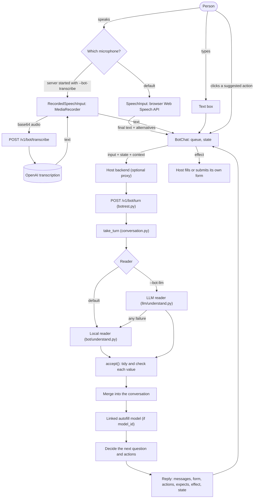
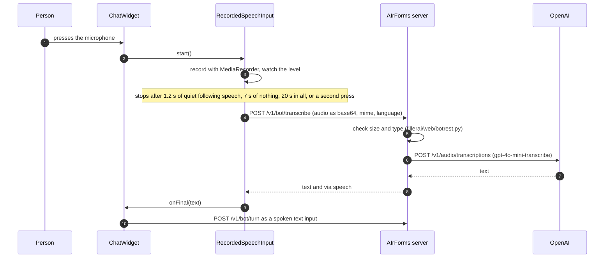
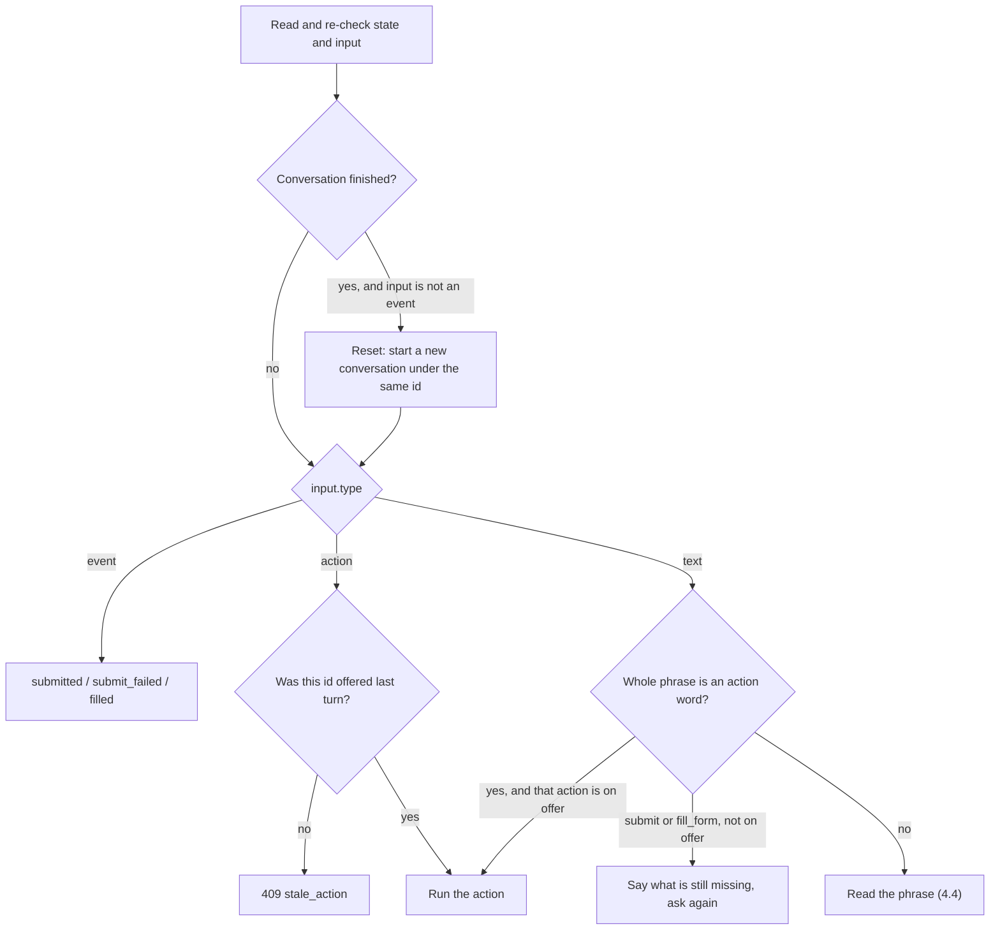
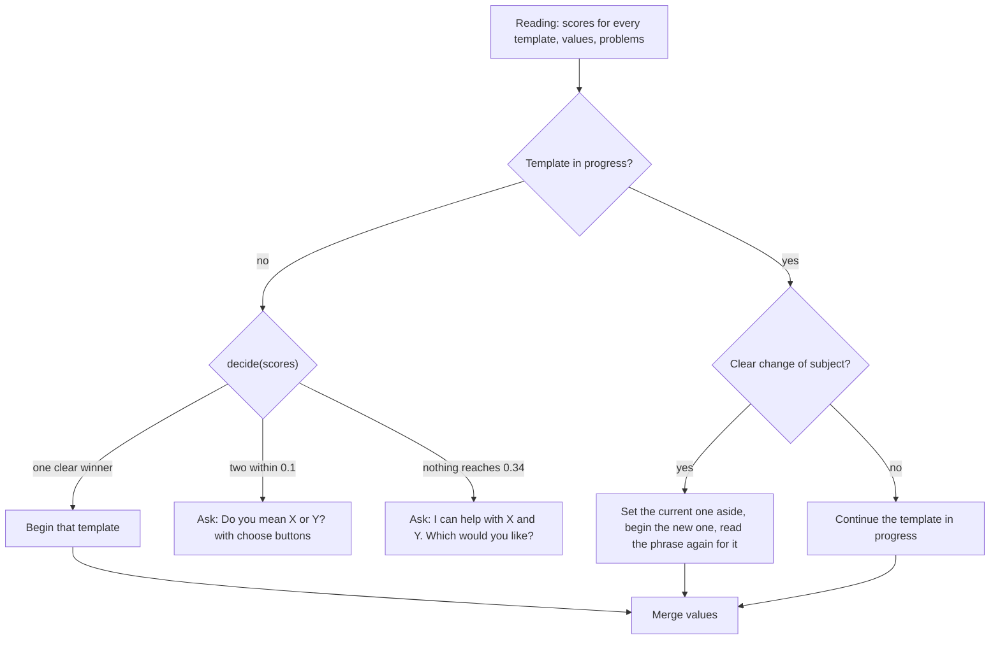
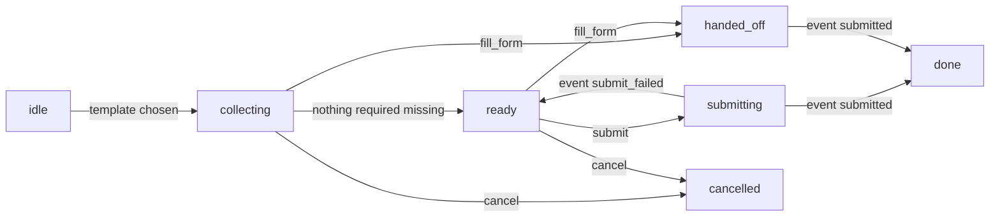
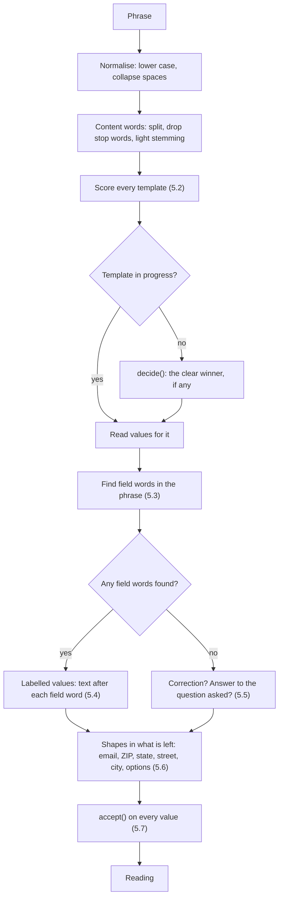
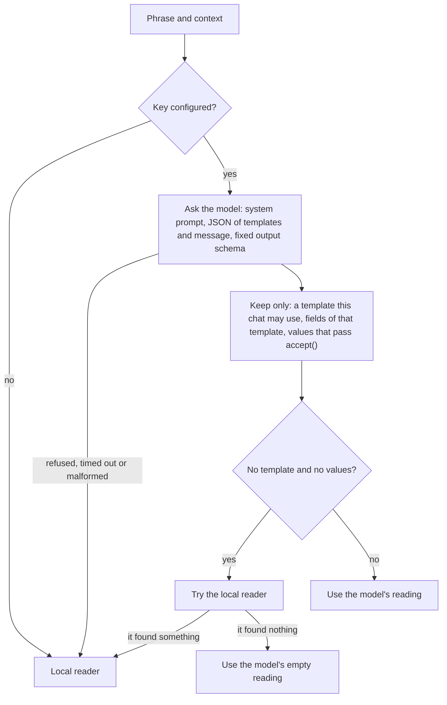

# How the chatbot understands language

This page explains how the bot service turns what a person types or says into
a filled-in request: what happens in the browser, what one turn does on the
server, and exactly how the phrase is read. The API contract itself (request
and reply shapes, endpoints, error codes) is in
[bot-builder.md](bot-builder.md) and is linked rather than repeated here.

Checked against the code at version 0.19.0. Every example output on this page
was produced by running the code with the two starter templates (first at
0.15.1; the bot's code has not changed since, and §9's session reproduces
unchanged).

**Contents**

1. [In plain words](#1-in-plain-words)
2. [The whole path of one message](#2-the-whole-path-of-one-message)
3. [In the browser: typing and speaking](#3-in-the-browser-typing-and-speaking)
4. [On the server: one turn](#4-on-the-server-one-turn)
5. [The local reader, step by step](#5-the-local-reader-step-by-step)
6. [The language-model reader](#6-the-language-model-reader)
7. [Worked examples](#7-worked-examples)
8. [Limits, and why](#8-limits-and-why)
9. [How to try and test it](#9-how-to-try-and-test-it)
10. [Possible improvements](#10-possible-improvements)
11. [Where the code is](#11-where-the-code-is)

---

## 1. In plain words

### 1.1 What the bot does

A company describes each kind of request it handles as a **template**: an
address change has a street, a unit, a city, a state, a ZIP code and a
country; a document request has a policy number, a document type and a name.
Each template also carries a few example phrasings ("update my address", "I
moved") and the words people use for each field ("house no", "zip").

When a person writes "please update my city from SFO to Irvine and house no
1429 Silverstein", the bot does three things:

1. **Works out which request it is.** Here, an address change.
2. **Pulls out the values.** City is now Irvine (and was SFO), street address
   is 1429 Silverstein.
3. **Decides what to do next.** The state and ZIP code on file belonged to the
   old city, so it asks for them, and it offers to fill the form or, once
   everything is there, to submit it.

The bot never changes anything itself. It tells the application that hosts
the chat window what to fill in or submit, and that application does it.

### 1.2 What "understanding" means here

"Understanding" in this bot is narrow and deliberate. It does not understand
language in general. It answers three questions against a short, known list
of templates:

| Question | How it is answered by default |
|---|---|
| Which template does this phrase mean? | By how many of the phrase's words appear in each template's examples, name and description, plus how many of its field names the phrase mentions. |
| Which values does it carry? | By finding a field's words ("city", "zip", "house no") and taking what follows them, and by recognising values with an unmistakable shape (a ZIP code, an email address, a state name) when only one field could hold them. |
| Is it an instruction rather than information? | By comparing the whole phrase, with politeness removed, against short fixed lists ("submit", "yes", "start over"). |

When it cannot tell, it says so and asks, rather than guessing. That is the
most important property of the design: a wrong guess on an address change is
worse than a question.

### 1.3 Why rules and word lists rather than a language model

The default reader is a set of rules and word lists written in plain Python.
It is not a trained model and not a large language model (LLM). The reasons:

- **Nothing leaves the machine.** What a customer types is their personal
  data. The default reader runs inside the AIrForms process and sends nothing
  anywhere. This is the same rule the rest of AIrForms keeps: Python standard
  library only, no network unless someone deliberately turns a feature on.
- **The problem is small.** A business has a handful of templates, and "update
  my city" is not hard to tell from "send me my policy documents". A
  word-overlap score is enough to separate them, and when it is not, the bot
  asks.
- **It is predictable and explainable.** Every decision can be traced to a
  word list or a threshold in `fillerai/bot/understand.py`. When the bot
  misreads a phrasing, the fix is usually to add that phrasing to the
  template's examples or aliases, which a non-programmer can do on the Bots
  tab.
- **It is fast and free.** A whole turn takes well under a millisecond on a
  laptop (about 0.6 ms measured for the long example in §7.1), with no
  per-message charge.

The cost is that it only understands phrasings close to what the template
describes. "We're moving in with my sister in Tustin" names a city without
saying "city", and the local reader cannot find it. That is what the optional
language-model reader is for.

### 1.4 The two optional extras, and what leaves the machine

Both are **off by default**, and having an API key is not enough to turn them
on: each needs its own switch when the server starts.

| Feature | Switch | What it adds | What leaves the machine, and to whom |
|---|---|---|---|
| Local reader (default) | always on | Everything in §5. | Nothing. |
| Language-model reader | `fillerai serve --bot-llm` or `FILLERAI_BOT_LLM=1`, plus a key | Reads phrasings the local reader cannot, such as a city named without the word "city". | Per reading: the message text; every template this chat may use (key, name, description, first five examples, field names, labels, types, and options up to 40); which template is in progress; which field was just asked about and which was mentioned last. Sent to the configured provider (Anthropic or OpenAI). The values the host holds on file (`context.current`) and the values collected so far are **not** sent. |
| Server-side transcription | `fillerai serve --bot-transcribe` or `FILLERAI_BOT_TRANSCRIBE=1`, plus an OpenAI key | A microphone that works where the browser's own speech service is blocked (a VPN, a corporate proxy). | The recorded audio of each spoken message, and a two-letter language code, sent to OpenAI's transcription endpoint. Only OpenAI: Anthropic's API does not transcribe audio, and an Anthropic key is never sent to OpenAI. |

Separately from AIrForms, **the browser's own speech recognition** (the
default microphone) is the browser's business. Chrome and Edge send the audio
to their vendor's speech service; AIrForms receives only the resulting text.
A host that must keep audio in-house can turn the microphone off and plug in
its own recogniser ([bot-builder.md §9](bot-builder.md#9-what-this-does-not-do)).

---

## 2. The whole path of one message



The browser side is described in §3, the turn in §4, and the reader, which is
where the language processing happens, in §5 and §6.

---

## 3. In the browser: typing and speaking

All of this is in `fillerai/web/static/client/fillerai.js`, which has no
dependencies. The classes are introduced in
[bot-builder.md §7](bot-builder.md#7-the-javascript-client); this section is
about what they do with language.

### 3.1 Typed text

The text box hands its contents to `BotChat.say(text)`, which sends
`{"type": "text", "text": ..., "via": "typed"}`. The server collapses runs of
whitespace and refuses anything over 1,000 characters (`413 too_large`).

### 3.2 The browser's speech recognition (`SpeechInput`)

`SpeechInput` wraps the Web Speech API (`SpeechRecognition`, or
`webkitSpeechRecognition` in Chrome and Safari). It is configured as:

| Setting | Value | Why |
|---|---|---|
| `lang` | the option given, else the page's `<html lang>`, else `en-US` | The recogniser needs to know the language. The bot's own replies are English regardless (§8). |
| `interimResults` | `true` | The widget shows the words as they are recognised. |
| `maxAlternatives` | `3` | The runners-up are sent as `alternatives`, and the server tries them if the first reading finds nothing (§4.4). |
| `continuous` | `false` | One phrase per press of the microphone. |

When a phrase is final, `onFinal(text, alternatives)` calls
`BotChat.speak(text, alternatives)`, which sends the same text input with
`via: "speech"`. Before the first use it opens the microphone directly with
`getUserMedia`, so that a refusal by the page, browser or operating system is
reported in words (`SpeechInput.explain(code)`) rather than as a bare error
code. `SpeechInput.problem()` names what stops it on this page (no
recogniser, not a secure origin, Brave) and the widget greys the microphone
out.

### 3.3 Recorded speech, transcribed on the server (`RecordedSpeechInput`)

When the server runs with `--bot-transcribe`, the widget records audio itself
instead of using the browser's recogniser:



The silence detection is a simple loudness check in the page: every 100 ms it
computes the root-mean-square level of the microphone signal and treats
anything above 0.02 as speech. The server side (`fillerai/llm/transcribe.py`)
accepts webm, ogg, mp4, mp3, m4a and wav up to 4 MB, passes only the first
two letters of the language tag (`en-US` becomes `en`), and turns every
failure into `502 transcription_failed` with a sentence the chat can show.
This route gives no alternatives; the transcript is one string. Once the text
comes back, the turn is exactly the same as a typed or browser-recognised
one.

### 3.4 `BotChat`: order, state and reset

- **One at a time, in order.** Every input is queued behind the one before
  it, so a quick second message cannot overtake the first and read against
  stale state.
- **State goes back unchanged.** Each reply carries `state`; `BotChat` keeps
  it and sends it with the next input. The page never interprets it.
- **Context is read every turn.** `current` (what the host holds for this
  person) can be a function, so a change to the host's form between messages
  is seen on the next turn.
- **Reset drops an in-flight reply.** `reset()` bumps an internal counter; a
  reply that comes back for the old counter is returned marked `stale` with
  its `effect` removed, so it cannot submit anything after the person started
  over.

When the phrase answered was spoken, `ChatWidget` reads the reply aloud with
the browser's `speechSynthesis`. Which voice engine that uses (on the device
or online) is up to the browser; this is an inference, since the code does not
choose a voice.

---

## 4. On the server: one turn

### 4.1 The endpoint

`POST /v1/bot/turn` is `turn()` in `fillerai/web/botrest.py`. It does no
reading of its own:

1. It lists the templates this token may use (all of the owner's templates,
   or only those linked to the token's model for a pinned token) and narrows
   them to `context.templates` if given. An unknown key is `404
   unknown_template`.
2. It picks the **reader**: `READER(owner)` returns the language-model reader
   when the server was started with `--bot-llm`, and `None` otherwise, which
   means the local reader.
3. It builds the **completer** from `model_completer` (§4.6), which is only
   used when a template has a `model_id`.
4. It calls `take_turn(templates, body, reader=..., complete=...)` and turns
   a `BotError` into the usual `/v1` error with a stable `code`.

The Bots tab's try-it chat goes through `/api/bot/turn`, which runs the same
`run_turn` but also offers the two starter templates when the library does
not have them yet, so "document request" works in an empty library.

### 4.2 `take_turn`: what kind of input is this?

`take_turn` in `fillerai/bot/conversation.py` is a pure function: the reply
depends only on the templates, the request and the reader. It keeps nothing
between calls.



The state is checked from scratch on every turn because it has been through
the end user's browser: the template must be allowed, every field must be the
template's, and every value must pass `accept()` (§5.7) again. A failure is
`400 bad_state`. See
[bot-builder.md §4](bot-builder.md#4-turns-without-a-session-on-the-server).

### 4.3 Actions typed or spoken as words

Before a phrase is read for information, `action_phrase()` checks whether the
**whole phrase** is an instruction. It lower-cases the phrase, removes
politeness words (`please`, `pls`, `thanks`, `thank you`, `now`, `then`,
`ok`, `okay`), drops everything but letters, apostrophes and spaces, and
looks the result up in four fixed lists:

| Meaning | Some of the phrases |
|---|---|
| `submit` | submit, submit it, send it, send, file it, yes submit, submit the form |
| `fill_form` | fill the form, fill it in, prefill, manual, manually, let me do it, i'll submit it myself |
| `cancel` | cancel, start over, restart, reset, never mind, forget it, stop, clear |
| `confirm` | yes, yeah, yep, sure, correct, confirm, go ahead, do it, looks good, that's right, yes please |

Only an exact match of the whole phrase counts, so "submit" is an action and
"submit a claim for my car" is not. `confirm` means "the primary action on
offer": submit if it was offered, otherwise fill the form. A phrase that is
an action but whose action was not offered is not read as a value either:
"submit" while the state is still missing gets "I still need the state and
ZIP code before I can submit it."

This check happens before any reader runs, so with `--bot-llm` on, "yes" and
"submit" are never sent to a language model.

### 4.4 Reading a phrase and choosing the template

`_on_text` calls the reader with the phrase, the template in progress (if
any), the field the last question was about (`expects`) and the field
mentioned last (`last_field`). If the reading finds no values and no
template, each speech alternative is tried in turn, and the first one that
reads something is used.



When the bot has to ask which template, the phrase is kept in the state as
`pending` and read again for the template the person picks, so nothing they
said is lost.

**The switching rule.** With a template in progress, a phrase switches to
another template only when one of these holds:

- the language-model reader named a different template outright; or
- every value read was taken only as "the answer to the question just asked"
  (weak evidence), the other template scores at least **0.5**, and it beats
  the current one by at least **0.2**.

So "and the unit is 4B" stays on the address change, while "I need a copy of
my policy" during an address change switches to the document request. The
address change's values are **parked** in the state and come back if the
person returns to it; the reply says "I've set the address change aside." and
`intent.changed` is `true`.

### 4.5 Merging values, `follows` and "outdated"

Each value read goes through `accept()` once more and is stored with its
source (`said`, `clicked` or `model`), its confidence and any old value the
person mentioned (`said_before`). A newer value for a field replaces the
older one, which is how "actually make it Tustin" corrects the city.

The before/after table is then rebuilt from three things: what the person
said, what the host holds (`context.current`), and each field's `follows`
list. A field whose value on file depends on a field that has just changed
is marked `outdated` rather than carried over, and asked for if it is
required. In the starter address template, `state` follows `city` and
`postal_code` follows `street_address`, `city` and `state`, so a new city
makes the old state and ZIP code questions again. The statuses are listed in
[bot-builder.md §3.2](bot-builder.md#32-the-reply).

### 4.6 The linked autofill model

If the template has a `model_id`, and something changed this turn, the
completer (`model_completer` in `fillerai/bot/__init__.py`) asks that trained
AIrForms model to predict the other fields:

- It passes only values the person **said or clicked**, not values carried
  over from the host or earlier model guesses, and only for fields the model
  knows.
- It keeps a guess only for a field the template has, when the model marks it
  known, and when its calibrated confidence is at least `ACCEPT_ABOVE` (0.7,
  from `fillerai/train/model.py`).
- A guess never overwrites a value the person gave; it can replace an earlier
  model guess.
- Each guess goes through `accept()` like any other value.
- If the model fails to load or predict, the turn goes on without guesses.

So "change my city to Irvine" can come back with the state already filled as
`CA`, `source: "model"`, and its confidence, when the linked model has learned
that Irvine is in California. How the model makes that prediction is
described in [architecture.md](architecture.md) and
[llm-modelling.md](llm-modelling.md); the bot only consumes it.

### 4.7 Deciding what to say and offer

`_next_step` writes the reply in a fixed order:

1. What changed this turn, in the template's field order ("Street address to
   1429 Silverstein and city to Irvine."), led by "OK, an address change." on
   the turn the template was chosen.
2. Up to two problems ("I couldn't use "123" for state: that does not look
   like a state.").
3. The next step: the **first missing required field** in template order is
   asked ("What is the new state? For example CA."), or, when nothing is
   missing, "That's everything. Shall I submit it, or fill the form so you
   can check it first?".

A template whose name or description contains "change", "update" or "move"
(or "changed", "updated") is treated as a **change request**. The code also
lists "new", but "new" is a stop word and is removed before the check, so it
never counts. The questions then say "new"
("What is the new ZIP code?"), and while nothing differs from what is on
file, the bot asks "What would you like to change?" and does not offer
Submit. The example hint ("For example 92618") is added only when the message
was typed, not spoken.

The conversation's status moves like this:



A finished conversation (`handed_off`, `done`, `cancelled`) that receives new
text starts over under the same conversation id.

### 4.8 What travels in `state`

The template key; every value with its source, confidence and `said_before`;
`expects` (the field just asked about, so a bare "92618" lands in the ZIP
code); `last_field` (for corrections); `offered` (the action ids on the last
reply, so a stale or repeated click is refused with `409 stale_action`);
`pending` (a phrase waiting for the person to pick a template); `parked`
(templates set aside); the status; and the turn number.

---

## 5. The local reader, step by step

`fillerai/bot/understand.py`, about 570 lines of standard-library Python.
Its entry point is `read(templates, active, text, expects=..., last_field=...)`,
which returns a `Reading`: every template's score, best first; the values
found, each a `Found(value, said_before, how, confidence)`; and any problems.



### 5.1 Normalisation and tokenisation

| Step | Function | What it does |
|---|---|---|
| Normalise | `_squash` | Lower-cases and collapses all whitespace to single spaces. |
| Tokenise | `content_words` | Takes runs of `a-z` and `0-9` as words. Everything else, including accented letters, splits words ("José" becomes `jos`). |
| Stop words | `_STOP` | Drops 69 function words and fillers: articles, pronouns, prepositions, "please", "can", "would", "want", "need", "hi", "thanks", and also "new" and "old". Words of one character are dropped too. |
| Stemming | `_stem` | Removes one ending, the first that fits of `ing`, `es`, `ed` and `s`, and only when the word is more than three letters longer than the ending. |

The stemming is deliberately crude and it shows. "updated" becomes `updat`
but "update" stays `update`, so they do not match; "address" becomes `addres`
(the final `s` is taken) while "addresses" becomes `address`. It works well
enough because the same function is applied to the template's examples and to
the phrase, and because most matches are on words that do not change.
Improving it is listed in §10.

Content words are used only for **choosing the template**. Values are always
cut from the original text, so "1429 Silverstein" keeps its capitals.

### 5.2 Intent: scoring the phrase against each template

`score(template, text)` gives a number from 0 to 1. With **S** the phrase's
content words:

| Evidence | Score it contributes |
|---|---|
| Best example: for each example with content words **E**, the share of the example's words the phrase contains, \|S ∩ E\| / \|E\| | up to 1.0 |
| The template's name, the same share | up to 0.85 (× 0.85) |
| The template's description, the same share | up to 0.6 (× 0.6) |
| Field mentions: each field whose words (the six longest, see §5.3) appear in the phrase adds 0.12 | up to +0.3 |

The score is the best of the first three plus the field bonus, capped at 1.0.
The overlap is measured against the **example**, not the phrase, so a long
phrase is not penalised for extra words: "please update my city from SFO to
Irvine and house no 1429 Silverstein" matches all of "change my city" except
"change".

`rank()` scores every template, and `decide()` turns the ranking into an
answer:

| Constant | Value | Meaning |
|---|---|---|
| `MATCH_AT` | 0.34 | Below this, a template is not what the person meant. |
| `AMBIGUOUS_WITHIN` | 0.1 | If two or more templates are within 0.1 of the best, the bot asks which one (at most four choices). |
| `SWITCH_AT` | 0.5 | In `conversation.py`: the least a different template must score to take over a conversation in progress. |
| `SWITCH_MARGIN` | 0.2 | In `conversation.py`: how much it must beat the template in progress by. |

This is a form of **nearest-example matching**: the templates' examples are
the only "training data", and a new template works as soon as it has a few
examples. Nothing is learned from past conversations.

### 5.3 Field words

`TemplateField.words()` collects everything a person might call a field,
lower-cased and without duplicates, longest first:

1. the field's label ("ZIP code");
2. its name with underscores as spaces ("postal code");
3. the template's aliases for it ("zip", "zipcode", "postcode");
4. the defaults for its semantic type, from `DEFAULT_ALIASES` in
   `fillerai/bot/template.py` ("zip code", "pin code", ...).

Longest first matters: "zip code" must be found before "zip", or "code" would
be taken as the start of the value.

`_mentions()` finds every occurrence of every field word in the phrase, with
word boundaries, longest words first, never overlapping an earlier find. A
word that belongs to two fields (for example "number", a default for phones,
when a template also has an account number) is used only if it is exactly one
field's label; otherwise it is ignored as evidence of either.

### 5.4 Labelled values: the text after a field's words

For each field word found, the value is the text from the end of that word to
the start of the next field word found (or the end of the phrase). Then:

1. **A comma or semicolon ends a value**, unless the span is a "from X to Y"
   phrase. "apt 4B, Austin, Texas" gives the unit `4B`, and the rest goes to
   the shape pass.
2. **Linking words are trimmed** from both ends, repeatedly (`_clean`):
   leading "is", "to", "as", "should be", "now", "no.", "number", "#",
   "my", "the", "changed to", "set to" and similar; trailing "and", "also",
   "please", "thanks", "my", "the", "as well", "too" and punctuation.
3. **Old and new values are recognised** in two phrasings:
   "from X to Y" (also "into", "->", "=>", optionally led by "is", "was" or
   "currently"), and "Y instead of X" (also "rather than", "not"). The new
   value is taken, and the old one kept as `said_before` with confidence
   0.95.
4. **Naming the template is not a value.** If everything after the field word
   is words from the template's name, it is skipped. "document request"
   contains "document", a word of the document type field, but "request" is
   not a document type.
5. The first value found for a field wins within one phrase.
6. Every value goes through `accept()` (§5.7). A value that fails becomes a
   **problem**, which the bot reports in words.

### 5.5 Phrases with no field words

When no field word appears at all, two readings are tried, only for the
template already in progress:

- **A correction.** "actually make it Tustin", "no, it's 4B", "I meant
  Tustin" (optionally led by "no", "actually", "sorry", "oops", then "make
  it", "change it to", "it should be", "it's", "use", "I meant") replaces the
  value of the field mentioned last.
- **An answer to the question just asked.** If a field is in `expects`, the
  phrase is not an action, and it has twelve words or fewer after trimming,
  the whole phrase is offered to that field. If `accept()` refuses it, the
  shape pass gets a look instead: "92618" while the bot is asking for the
  state is not a state, but it is a ZIP code, and it lands there (§7.2).

### 5.6 Values recognised by their shape

`_by_shape()` runs over what is left of the phrase after the labelled values
are cut out. Each recogniser fills a field only if **exactly one** still-empty
field in the template could hold that kind of value, which is what keeps a
shape match from guessing between two fields.

| Recogniser | Pattern (simplified) | Field it fills | Confidence |
|---|---|---|---|
| Email | `name@domain.tld` | the one `email` field | 0.8 |
| US ZIP | five digits, optional `-1234`, not part of a longer number | the one `postal_code` field | 0.8 |
| Canadian postal code | `A1A 1A1` | the one `postal_code` field | 0.8 |
| State by name | any of the 50 states and DC, spelled out, longest names first | the one `state` field, as its two-letter code | 0.75 |
| State by code | two capital letters that are a US state code, followed by a ZIP, a comma, a full stop or the end | the one `state` field | 0.75 |
| Street | a house number, up to four words, then a street suffix (St, Ave, Rd, Blvd, Way, Ct, ...) | the one `street_address` field | 0.75 |
| City | up to three words right before a recognised state, after the start, a comma, "to" or "in" | the one `city` field, only if a state was found | 0.7 |
| Option | a closed-list option that only one field offers; options of three characters or fewer must be written exactly as listed ("CA", not "ca") | that field | 0.75 |

The case rule for short options and state codes is there because "in", "or"
and "me" are English words first and state codes second. Phone numbers are
checked by `accept()` when labelled, but there is no unlabelled phone
recogniser: a run of digits is too easily something else.

### 5.7 `accept()`: tidying and checking a value

Every value from every source (the local reader, the language model, a
clicked button, the linked model, and the state sent back by the browser)
goes through `accept(field, raw)`. "What may go in a field" is decided in
this one function.

| Check | Applies to | Result |
|---|---|---|
| Collapse spaces, strip surrounding `, ; . ! ? " '` | all | tidied text |
| Empty | all | refused: "nothing was said for it" |
| Longer than 120 characters | all | refused: "that is too long to be one value" |
| No letters at all | city, state, country, first, middle, last and full name | refused |
| State name or code, any case | state | converted to the code ("california", "ca" become `CA`) |
| Digits, or over 40 characters | state (when not a known state) | refused |
| Country words | country | converted to a code ("usa", "united states", "america" become `US`; also Canada, Mexico, UK, India, Australia, Germany, France, Japan, Brazil) |
| Contains a US ZIP or Canadian postal code | postal code | that code, upper-cased; otherwise 3 to 10 letters, digits, spaces or hyphens, or refused |
| Contains an email address | email | that address; otherwise refused |
| 7 to 15 digits | phone, mobile | kept as written; otherwise refused |
| On the field's options list | any field with options | the option as listed; case and spacing are forgiven, a state name matches a code option and the reverse, and a value that contains exactly one option (of more than two characters) as a whole word is taken as that option. Otherwise refused: "it has to be one of ..." |

A state **not** on a list and not a known state name is kept as typed if it
has no digits and is 40 characters or fewer. So with the starter template,
whose state field has no options, "Mars" is accepted as a state (§8).

### 5.8 Confidence numbers

The confidences the reply reports for each value are fixed by how the value
was found. They are rankings of how direct the evidence was, not measured
probabilities.

| How | Confidence |
|---|---|
| Clicked answer button | 1.0 |
| "from X to Y" or "Y instead of X" after a field word | 0.95 |
| After a field word | 0.9 |
| Answer to the question asked | 0.9 |
| Correction ("make it ...") | 0.9 |
| Language-model reader | 0.85 |
| Email or postal code by shape | 0.8 |
| State, street or option by shape | 0.75 |
| City before a state | 0.7 |
| Linked autofill model | the model's calibrated confidence, at least 0.7 |

The template score (`intent.confidence`) is the score from §5.2 on the turn
the template is chosen. On later turns it is the template's score for that
phrase, which is often 0.0 for a bare answer such as "92618" (see §7.2): it
means "this phrase alone did not name the template", not "the bot is unsure".

### 5.9 What it deliberately does not do

- **It does not guess between fields.** A shape match needs exactly one
  candidate field; a shared word needs to be one field's label.
- **It does not correct spelling.** "adress" is not "address". "change my
  adress" still finds the address template through "change", but the word
  is not recognised as the street field.
- **It does not know place names beyond US states and a few countries.**
  There is no list of cities or streets; a city is found after the word
  "city" or "town", or right before a state.
- **It does not invent values.** Everything in `values` was said, clicked,
  held by the host, or predicted by the linked model above its threshold.
- **It does not learn from conversations.** Nothing is stored; it improves
  only when someone adds examples or aliases to a template.
- **It does not split a message into two requests** (§8).

---

## 6. The language-model reader

`fillerai/llm/understand.py`, used only when the server runs with `--bot-llm`
and a key is available (the owner's key from Settings, laid over the
environment). It returns the same `Reading` as the local reader, so the rest
of the turn does not know which one answered, except through `intent.how`
(`local` or `llm`).



**What it asks.** The system prompt (`SYSTEM`) tells the model to name the
template the message is about or `null`; to report only values the person
actually said, never invented or looked up; to split "from SFO to Irvine"
into the value and `said_before`; to use an option exactly as listed; to take
a bare answer as the value of the field just asked about; and to give a
confidence from 0 to 1. The user message is a JSON document with the
templates (as in §1.4), `in_progress`, `just_asked_about`,
`last_field_mentioned` and `message`. The answer must match `OUTPUT_SCHEMA`:
`{"template": string or null, "confidence": number, "values": [{"field",
"value", "said_before"}]}`, requested as structured output from the provider,
with a budget of 2,000 output tokens. The default model for this task is
`claude-haiku-4-5` on Anthropic or `gpt-5-mini` on OpenAI
(`fillerai/llm/providers.py`), changeable with `FILLERAI_LLM_MODEL`.

**How far it is believed.** `read_answer()` drops a template key the chat may
not use, drops fields the template does not have, and puts every value
through the same `accept()` as a typed value. A refused value becomes a
problem the bot reports, exactly as it would for typed text. Every accepted
value gets confidence 0.85 whatever the model said; the model's confidence is
used only as the template score.

**When it fails.** Any exception at all, including no key, a network error, a
refusal or an answer that is not the right shape, returns the local reading
for that turn. The turn never fails because the model did.

**Things to know when turning it on** (from reading `conversation.py`):

- Action phrases ("yes", "submit", "start over") are resolved before the
  reader runs and never reach the model.
- When the model names a different template from the one in progress, the bot
  switches immediately; the 0.5 and 0.2 thresholds of §4.4 apply only to
  scores from the local reader.
- One turn can make more than one model call: once per speech alternative
  until one reads something, and once more when the phrase switches template
  and has to be read again for the new one.
- It has only been tested against recorded answers, never a live model
  ([pending.md §1.8](pending.md)).

---

## 7. Worked examples

These are real outputs from `take_turn` with the two starter templates
(`fillerai/bot/starters/`), trimmed for reading. The host holds this address
for the person in every address example:

```json
{"street_address": "55 Market St", "unit": "", "city": "San Francisco",
 "state": "CA", "postal_code": "94105", "country": "US"}
```

### 7.1 "please update my city from SFO to Irvine and house no 1429 Silverstein"

**Action check.** `action_phrase` → `None`; it is not an instruction.

**Content words.** `1429 city house irvine no sfo silverstein update`
("please", "my", "from", "to", "and" are stop words).

**Template scores.**

| Evidence for `address_change` | Score |
|---|---|
| Best example: "update my address" (`update`, `addres`) shares `update`: 1/2; "change my city" shares `city`: 1/2 | 0.5 |
| Name "Address change": no overlap | 0 |
| Description "Update the mailing address on file": `update` is 1 of 4, × 0.6 | 0.15 |
| Field mentions: "house no" (street address) and "city" | + 0.24 |
| **Total** | **0.74** |

`document_request` scores 0.0. `decide` → `address_change`.

**Field words found.** `city` at characters 17 to 21, `house no` at 45 to 53.

**Values.**

| Field | Raw span | After trimming | Pattern | Result |
|---|---|---|---|---|
| city | `" from SFO to Irvine and "` | `from SFO to Irvine` | from X to Y | `Irvine`, `said_before: SFO`, 0.95 |
| street_address | `" 1429 Silverstein"` | `1429 Silverstein` | none | `1429 Silverstein`, 0.9 |

**Shape pass** over what is left, `"please update my"`: nothing.

**Merge and follows.** City and street changed. State follows city, and ZIP
follows street, city and state, so both are marked `outdated`. Country is
kept from the host.

**Reply** (trimmed):

```json
{
  "intent": {"template": "address_change", "confidence": 0.74, "how": "local", "changed": true},
  "messages": [{"role": "bot", "text": "OK, an address change. Street address to 1429 Silverstein and city to Irvine. What is the new state? For example CA."}],
  "form": {
    "fields": [
      {"name": "street_address", "before": "55 Market St", "after": "1429 Silverstein", "source": "said", "confidence": 0.9, "status": "changed"},
      {"name": "unit", "before": null, "after": null, "status": "empty"},
      {"name": "city", "before": "San Francisco", "after": "Irvine", "source": "said", "confidence": 0.95, "status": "changed", "said_before": "SFO"},
      {"name": "state", "before": "CA", "after": null, "status": "outdated"},
      {"name": "postal_code", "before": "94105", "after": null, "status": "outdated"},
      {"name": "country", "before": "US", "after": "US", "source": "current", "status": "kept"}
    ],
    "missing": ["state", "postal_code"]
  },
  "actions": [{"id": "fill_form", "style": "primary"}, {"id": "cancel"}],
  "expects": {"field": "state", "label": "State", "semantic_type": "state"},
  "state": {"expects": "state", "last_field": "street_address", "offered": ["fill_form", "cancel"], "...": "..."}
}
```

### 7.2 A bare answer: "CA", then "92618"

The state says `expects: "state"`. "CA" has no field words, is not an action
and is not a correction, so the whole phrase is offered to the state field:
`accept` recognises the code, and the value is `CA`, how `expected`,
confidence 0.9. It equals what is on file, so its status is `unchanged`.

```text
bot> State to CA. What is the new ZIP code? For example 92618.
```

Now `expects: "postal_code"`, and "92618" goes to the ZIP code the same way:

```json
{
  "intent": {"template": "address_change", "confidence": 0.0, "how": "continued", "changed": false},
  "messages": [{"role": "bot", "text": "ZIP code to 92618. That's everything. Shall I submit it, or fill the form so you can check it first?"}],
  "form": {"missing": [], "complete": true,
           "changes": {"street_address": {"before": "55 Market St", "after": "1429 Silverstein"},
                       "city": {"before": "San Francisco", "after": "Irvine"},
                       "postal_code": {"before": "94105", "after": "92618"}}},
  "actions": [{"id": "submit", "style": "primary"}, {"id": "fill_form"}, {"id": "cancel"}],
  "expects": null
}
```

`intent.confidence` is 0.0 because "92618" alone names no template; the
conversation simply continued (§5.8).

**The same "92618" when the bot asked for the state instead.** `accept`
refuses it as a state (it has digits), so the shape pass looks, finds a ZIP
code, and puts it there. The bot then asks the state again:

```text
you> change my city to Austin
bot> OK, an address change. City to Austin. What is the new state? For example CA.
you> 92618
bot> ZIP code to 92618. What is the new state? For example CA.
```

### 7.3 "yes submit", and what follows

After §7.2 the offered actions are `submit`, `fill_form`, `cancel`.
`action_phrase("yes submit")` → `submit` (it is on the list as a whole
phrase), and `submit` is on offer, so it runs exactly as a click on Submit
would:

```json
{
  "conversation": {"turn": 4, "status": "submitting"},
  "messages": [{"role": "bot", "text": "Submitting your address change."}],
  "actions": [],
  "effect": {"type": "submit", "template": "address_change",
             "values": {"street_address": "1429 Silverstein", "city": "Irvine", "state": "CA",
                        "postal_code": "92618", "country": "US"},
             "changes": {"...": "as in form.changes"}}
}
```

"yes" alone would do the same: `confirm` means the first of submit or
fill_form on offer. The host submits and reports back with
`{"type": "event", "event": "submitted", "detail": {"reference": "CHG-20931"}}`:

```text
bot> Your address change is in. Your reference is CHG-20931.      (status: done)
```

Sending the Submit action again with the state from turn 4 is refused,
because that reply offered no actions:

```text
409 stale_action: that action was not offered on the last turn; it may already have been used
```

### 7.4 "document request", then "policy PA-1048822, ID card, by email"

**"document request".** Content words `document request`. The example
"request a document" has exactly those two words, so `document_request`
scores 1.0 and `address_change` 0.0. The field word "document" (an alias of
the document type) is found, but what follows it, "request", is a word of the
template's name, so it is not taken as a document type. No values; the
template is new, so:

```json
{
  "intent": {"template": "document_request", "confidence": 1.0, "how": "local", "changed": true},
  "messages": [{"role": "bot", "text": "Sure, a document request. What is the policy number? For example PA-1048822."}],
  "form": {"missing": ["policy_number", "document_type", "full_name"]},
  "actions": [{"id": "cancel"}],
  "expects": {"field": "policy_number"}
}
```

This template is not a change request, so the question has no "new", and
Submit is offered once the required fields are there.

**"policy PA-1048822, ID card, by email".** Field words found: `policy`
(policy number), `by` (delivery), `email` (email).

| Field | Span | Result | How |
|---|---|---|---|
| policy_number | `" PA-1048822, ID card, "`, cut at the first comma | `PA-1048822` | labelled, 0.9 |
| delivery | `" "` (between "by" and "email") | nothing, skipped | |
| email | `""` | nothing, skipped | |
| document_type | "ID card" in what is left, an option only this field offers | `ID card` | shape, 0.75 |
| delivery | "email" in what is left, matches the option `Email` | `Email` | shape, 0.75 |

```text
bot> Policy number to PA-1048822, document type to ID card and delivery to Email. What is the name?
```

### 7.5 An unclear and an ambiguous opening

"hello" scores 0.0 for both templates, below `MATCH_AT`:

```text
bot> I can help with address change and document request. Which would you like?
     [Address change] [Document request]
```

"new address please send documents" scores 1.0 for both ("new address" is an
address example; "send me my documents" a document example), so `decide`
returns both and the bot asks, keeping the phrase as `pending`:

```text
bot> Do you mean address change or document request?
     [Address change] [Document request]
```

### 7.6 The language-model reader, with a recorded answer

No live model has been called (§6). With a stand-in client that returns a
fixed answer, "we're moving in with my sister in Tustin" (which the local
reader cannot place; it scores 0.0 for both templates) reads as:

```text
model answer: template address_change, confidence 0.9,
              values city=Tustin, state=Mars, country=France, planet=Earth
Reading:      how=llm, template=address_change
              city  = Tustin (llm, 0.85)
              state = Mars   (llm, 0.85)      accepted: the starter state field has no options
              problem: country "France": it has to be one of US, CA, MX
              "planet" dropped: not a field of this template
```

With the same stand-in raising an error, "change my city to Austin" comes
back `how=local` with `city=Austin`: the turn falls back to the local reader.

---

## 8. Limits, and why

| Limit | Why it is so | What to do about it |
|---|---|---|
| **English only.** Stop words, action phrases, the correction and from/to patterns, stemming and every reply are English. Accented letters split words in template matching. | The word lists are hand-written for one language. | A template's examples and aliases can be in another language and will match; the bot's replies will not. See §10. |
| **No spelling correction.** "adress" is not "address"; "hose no" is not "house no". | Exact word matching; nothing in the standard-library design does fuzzy matching today. | Add common misspellings as aliases or examples, or see §10. |
| **One request per message.** A second request in the same message is not set aside for later. Worse, it can end up as a value: "change my address and send me an ID card" gives the street address "and send me an ID card", because "address" is a default word for the street field and everything after it is taken. | Values are the text after a field word up to the next field word; there is no clause splitting. | Ask for one thing at a time. Tracked in [pending.md §2.5](pending.md#25--the-chats-local-reader-defects-found-while-documenting-it). |
| **Unlabelled cities and streets are not found** unless written as an address ("12 Oak Ave apt 4B, Austin TX 78701" works; "moving in with my sister in Tustin" does not). | There is no gazetteer of place names, by design (no data files, no network). | Turn on `--bot-llm`, or the bot asks. |
| **Stemming is crude.** "updated" does not match "update"; "moving" does not match "moved". | A four-line suffix stripper, applied the same way on both sides. | Add the phrasing to the examples, or see §10. |
| **Speech alternatives are rarely used.** They are tried only when the first transcript finds no template and no values. "change my hose no to 12 Elm" already finds the address template through "change", so the alternative "house no" is never read. | Alternatives were meant for transcripts that read as nothing at all. | See §10 (score all alternatives and take the best). |
| **A free-text field without options accepts anything that looks like its kind.** "Mars" is a valid state for the starter template. | `accept()` checks shape, not truth, unless the field has an options list. | Give the field an options list (the 50 states), and validate on submit in the host, which the host must do anyway. |
| **"ok", "okay" and "please do" do not confirm.** They are in the confirm list, but `ok` and `okay` are removed as politeness before the lookup, leaving nothing, and "please do" becomes "do". | An ordering quirk in `action_phrase`. | Say "yes"; a fix is a small code change. |
| **`via: "speech"` changes only the example hint.** Spoken questions omit "For example 92618". Action phrases need a whole-phrase match whether typed or spoken. | That is all `conversation.py` does with `via`. The contract's §3.1 describes more. | None needed. [bot-builder.md §3.1](bot-builder.md#31-the-request) now says the same. |
| **The language-model reader is untested against a real model**, and the microphone has been checked by hand only. | No key in the test environment; the test browser has no microphone ([pending.md §1.8, §1.9](pending.md)). | Try it with a key before relying on it. |

---

## 9. How to try and test it

**At the terminal.** `fillerai bot chat` runs the same `take_turn` with the
local reader (it never uses the language model), against the library's
templates or, when there are none, the starters. `--current FIELD=VALUE ...`
sets what the host holds. A number clicks the matching action:

```text
$ python -m fillerai bot chat --current "street_address=55 Market St" "city=San Francisco" state=CA postal_code=94105 country=US
Say something (an action's number clicks it; empty line to stop).
you> change my city to Irvine
bot> OK, an address change. City to Irvine. What is the new state? For example CA.
       city: San Francisco -> Irvine
       [1] Fill the form for manual submission   [2] Start over
you> 92618
bot> ZIP code to 92618. What is the new state? For example CA.
       city: San Francisco -> Irvine
       postal_code: 94105 -> 92618
       [1] Fill the form for manual submission   [2] Start over
```

**In the UI.** The Bots tab has a try-it chat beside the template editor, with
a sample form that fills in as the conversation goes
([bot-builder.md §8](bot-builder.md#8-building-templates)).

**From Python.** `take_turn` needs no server:

```python
from fillerai.bot import take_turn
from fillerai.bot.template import starters

reply = take_turn(list(starters().values()),
                  {"input": {"type": "text", "text": "my zip is 92618 now"}, "state": None})
```

**The tests** (`python -m unittest discover -s tests -v` runs everything):

| File | Covers |
|---|---|
| `tests/test_bot.py` | Templates, the local reader (the phrase from the ask, address shapes, state codes not read as countries, ambiguity, answers, corrections, `accept`, action phrases) and whole turns (typed and clicked submit are the same, stale clicks, buttons for short option lists, switching and parking, speech alternatives, the linked model, the untrusted state). |
| `tests/test_bot_rest.py` | `/v1/templates` and `/v1/bot/turn` over HTTP: tokens, pinned tokens, error codes. |
| `tests/test_llm_understand.py` | The language-model reader with canned answers: a good answer is used, a bad template, field or value is dropped, any failure falls back to local. |
| `tests/test_llm_transcribe.py` | Transcription: key selection, size and type checks, the request sent, errors. |
| `tests/test_sample_app.py` | The sample host application driving the bot over HTTP. |

---

## 10. Possible improvements

Each option is measured against the two rules the bot keeps today: **no
dependencies outside the Python standard library**, and **nothing leaves the
machine unless someone turns it on**.

| Option | What it would fix | Cost and trade-off | Fits the rules? |
|---|---|---|---|
| **Fuzzy matching of field words and examples** with edit distance (`difflib.SequenceMatcher` or a small Levenshtein function) | Typos: "adress", "hose no", "zipcod". | Needs a cut-off to avoid "state" matching "stat" or short words matching each other; short words should stay exact. Slightly slower, still well under a millisecond for a few templates. | Yes. `difflib` is standard library. |
| **A real stemmer** (a Porter-style stemmer, about 300 lines of pure Python) | "updated" and "update", "moving" and "moved" matching. | More code to own; stemming can merge words that should stay apart. | Yes. |
| **Score every speech alternative** and take the best reading instead of the first non-empty one | The "hose no" case in §8. | A little more work per spoken turn; with `--bot-llm` it means one model call per alternative. | Yes. |
| **Clause splitting** on "and" and commas before extracting values, and a check that a value does not itself look like another request | The "and send me an ID card" street address; a second request could be parked instead of lost. | Harder than it looks: "Austin and Texas" is one address. Needs careful tests. | Yes. |
| **Naive Bayes intent classifier** over each template's examples (word counts per template, pick the most probable) | Weights words by how much they distinguish templates rather than counting them equally; a word such as "policy" that appears in both would count less. | Needs more examples per template than today's six to eight to beat the overlap score; scores are probabilities that are less easy to explain; must still keep an "I can't tell" threshold. Could be trained when a template is saved. | Yes. A few dozen lines of pure Python. |
| **TF-IDF with cosine similarity** against the examples | Same benefit as naive Bayes with fewer examples; a common alternative to plain overlap. | Similar explainability cost. | Yes. |
| **Word or sentence embeddings** (vector representations of meaning) | Synonyms and paraphrases: "relocating" close to "moving", "home" close to "address". | Needs a pre-trained model: either a dependency and tens to hundreds of megabytes of weights shipped with AIrForms, or a call to an embeddings API, which sends the message out. | Only as an optional, off-by-default feature, like `--bot-llm`. |
| **A small local language model** run on the same machine | Most of what the LLM reader does, without sending data out. | Needs a model runtime (a dependency), several gigabytes of weights and a capable machine; slower per turn. | Keeps data local, but breaks the no-dependency rule; would have to be optional. |
| **Place-name lists** (US cities, street types beyond today's list) | "moving in with my sister in Tustin". | A data file to ship and keep current; ambiguous names (a city called "Paris" in Texas). | Yes, if shipped as a data file. |
| **Multilingual support**: per-language stop words, action phrases, patterns and reply wording, chosen from the template or the request | Non-English users. | Every word list and every sentence the bot says has to be translated and tested per language; accented letters need the tokeniser widened to Unicode letters. | Yes, but it is the largest piece of work here. |
| **Sequence tagging for values** (a conditional random field or similar, trained on labelled phrases) | Finding values without a field word, from context. | Needs hundreds of labelled example phrases per template, which nobody has; much harder to explain a miss. | Possible in pure Python, but the data is the problem. |

**Why not clustering, such as K-means?** Clustering groups things that have
no labels yet. Here the groups are known in advance (the templates) and each
comes with examples, so the task is matching a phrase to a known group, which
is classification, not clustering. Clustering could still help offline: run
over a log of phrases the bot could not place, it would suggest new templates
or new example phrasings. That needs conversation logs, which the service
deliberately does not keep today.

The recommended order, if any of this is taken on, is: fix the small quirks
in §8 ("ok", "okay" and "please do" not confirming) and bring the contract's
wording about speech and second requests in line with the code, then fuzzy
matching and scoring all speech alternatives, then clause splitting, then a naive Bayes or TF-IDF intent score behind the same
`MATCH_AT` and `AMBIGUOUS_WITHIN` thresholds. Each of those keeps both rules.
Embeddings or a local model only make sense if the language-model reader
turns out to be needed often and sending messages out is not acceptable.

---

## 11. Where the code is

| Path | What is in it |
|---|---|
| `fillerai/web/static/client/fillerai.js` | `BotChat`, `SpeechInput`, `RecordedSpeechInput`, `ChatWidget`. |
| `fillerai/web/botrest.py` | `/v1/templates`, `/v1/bot/turn`, `/v1/bot/transcribe`; which reader and transcriber to use. |
| `fillerai/web/server.py` | `/api/bot/*` for the Bots tab; `--bot-llm` and `--bot-transcribe` wiring (`use_bot_llm`, `_bot_reader`, `_bot_transcriber`). |
| `fillerai/bot/conversation.py` | `take_turn`: state, inputs, actions, switching, merging, `follows`, questions, statuses, the reply. |
| `fillerai/bot/understand.py` | The local reader: words, scoring, `decide`, `read_values`, shapes, `accept`, `action_phrase`. |
| `fillerai/bot/template.py` | Templates, `TemplateField.words()`, `DEFAULT_ALIASES`, starters. |
| `fillerai/bot/__init__.py` | `model_completer`, the link to a trained autofill model. |
| `fillerai/bot/starters/` | The `address_change` and `document_request` starter templates. |
| `fillerai/llm/understand.py` | The language-model reader: prompt, output schema, checks, fallback. |
| `fillerai/llm/transcribe.py` | Server-side transcription through OpenAI. |

See also [bot-builder.md](bot-builder.md) for the contract,
[overview.md](overview.md) §4 for where the bot sits in the system,
[security.md](security.md) for tokens and data handling, and
[pending.md](pending.md) for what is still open.
