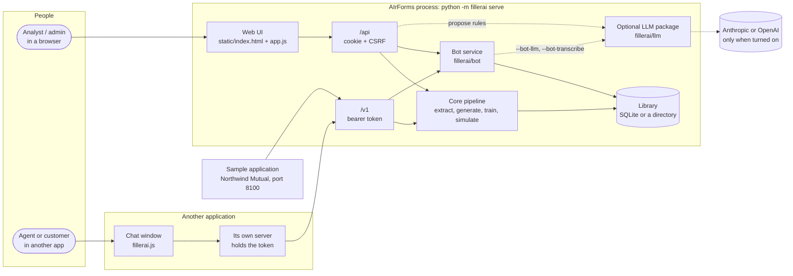
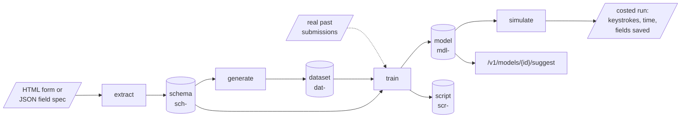
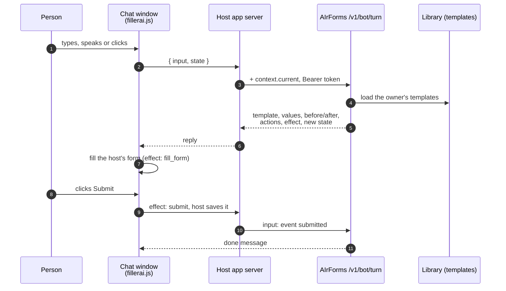

# Technical overview

The shortest complete description of AIrForms for an engineer meeting it for
the first time: what problem it solves, what the parts are, how a request
travels through them, and where to read next. Every other document in this
directory goes deeper into one of the boxes drawn here.

Checked against the code at version 0.15.0.

**Contents**

1. [What it is for](#1-what-it-is-for)
2. [The system at a glance](#2-the-system-at-a-glance)
3. [The modelling pipeline](#3-the-modelling-pipeline)
4. [The bot and the chat window](#4-the-bot-and-the-chat-window)
5. [Who can do what](#5-who-can-do-what)
6. [The rules the design keeps](#6-the-rules-the-design-keeps)
7. [Technology](#7-technology)
8. [Where to read next](#8-where-to-read-next)

---

## 1. What it is for

A customer service agent fills in hundreds of fields across several screens
for every case, and most of those values follow from the first few: a ZIP code
gives a city and a state, a plan type gives a deductible. AIrForms learns
those relationships and fills the rest of the form, saying how sure it is and
leaving alone what it cannot predict.

Two constraints shape everything else:

- **The companies with the forms will not hand over real data to train on.**
  So AIrForms reads the form itself (its HTML, or a short field spec),
  generates coherent synthetic records the form would accept, and trains on
  those. Real past submissions, where they exist, drop into the same training
  step with no change.
- **It runs where the forms live**, which is often a locked-down machine. It
  is Python 3 and the standard library only: no dependencies, no build step,
  no network unless somebody deliberately turns on one of the optional
  language-model features.

On top of the modelling there is a **bot service**: a chat window inside
another application that understands "please change my address to 1429
Silverstein, Irvine", fills that application's form, and lets the person
submit it or check it first.

## 2. The system at a glance

One process serves everything. `python -m fillerai serve` starts it on
`127.0.0.1:8000`, and by default also starts the sample application on
port 8100 as a second, independent program that reaches AIrForms only over
`/v1`, exactly as a customer's own application would.

| Part | Code | What it does |
|---|---|---|
| Web UI | `fillerai/web/static/` | Five steps (Source, Schema, Generate, Train, Simulate), the Library and Bots tabs, and Settings, which holds the admin cards for an administrator. Plain files, no build. |
| `/api` | `fillerai/web/server.py` | The UI's own endpoints. A session cookie and a CSRF header. May change with the UI. |
| `/v1` | `fillerai/web/rest.py`, `web/botrest.py` | The stable service for other applications: model suggestions and the bot. Bearer token only. |
| Core pipeline | `extract/`, `generate/`, `train/`, `simulate/` | The four modelling stages, over one shared schema contract. |
| Bot service | `fillerai/bot/` | Templates, reading a phrase, and a stateless conversation turn. |
| Library | `store.py`, `dbstore.py`, `db.py` | Everything a run produces, each entry pointing at what it came from. |
| Accounts | `auth.py`, `tokens.py` | People sign in with passwords; applications use API tokens. |
| LLM package | `fillerai/llm/` | Optional. Behind an import fence, off unless deliberately turned on. |
| JavaScript client | `web/static/client/fillerai.js` | One dependency-free ES module: form binding, `BotChat`, `ChatWidget`, `SpeechInput`. |
| Sample application | `fillerai/sampleapp/` | A made-up insurer's portal showing the chat and forms working in a separate app; the chat, or its menu, opens one form at a time. |

## 3. The modelling pipeline

1. **Extract** reads the markup or spec and decides what each field means: a
   name, a label, a screen, a type, and a *semantic type* (`postal_code`,
   `email`, `policy_number` and so on) chosen from ranked evidence. The result
   is a versioned `FormSchema`, the one contract every later stage shares.
2. **Generate** invents coherent people rather than random values: one
   persona per record, so the ZIP, city, state, phone area code and email all
   belong together. Relationships the form declares (`follows` / `when`) are
   honoured, and every generated identifier is from a range that cannot
   belong to a real person.
3. **Train** learns which fields predict which. Deterministic rules come
   first, then the selected engine (six are available: statistical, decision
   tree, random forest, nearest records, naive Bayes, linear), then a floor of
   plain frequencies. Every prediction carries a calibrated confidence, and a
   field the model cannot predict reliably is declined rather than guessed.
4. **Simulate** plays the model against forms it has never seen, the way an
   agent would type into them, and costs the result in keystrokes and time
   including the cost of correcting wrong suggestions.

Each stage writes a library entry that points at its input, so any model can
be traced back to the markup it came from. [process.md](process.md) walks
through every command; [architecture.md](architecture.md) §3 explains each
stage's internals.

## 4. The bot and the chat window

The things worth knowing before touching it:

- **One endpoint, one `input`.** Typed text, a transcribed phrase and a
  clicked suggestion all arrive as the same field, so a host implements one
  path.
- **Stateless.** The conversation lives in `state`, which the client sends
  back every turn and the service re-checks, because it has been through a
  browser. Nothing is held in server memory between turns.
- **The service never writes to the host.** It returns an `effect`
  (`fill_form` or `submit`); the host acts on it and reports back with an
  event.
- **Reading a phrase is local by default.** `serve --bot-llm` hands phrases to
  a language model instead; `serve --bot-transcribe` records audio in the page
  and transcribes it with an OpenAI key where the browser's own speech service
  is blocked. Both are off by default because they send what end users type
  or say to a third party.

The full contract, with real replies, is [bot-builder.md](bot-builder.md).

## 5. Who can do what

| Who | Credential | Reaches | Can |
|---|---|---|---|
| Anyone | none | the sign-in page, `/v1/health`, the static client | nothing else |
| A user | password, then a session cookie | the UI and `/api` | work with their own library, issue their own API tokens, add a language-model key for their session |
| An administrator | same | the admin cards in Settings | everything a user can, plus manage accounts and see the database |
| An application | `Authorization: Bearer flr_…` | `/v1` | read the token owner's models and templates, ask for suggestions, run bot turns |
| Everyone, with `--no-auth` | none | all of it, localhost only | one library for one person on one machine |

Every library entry has an owner and nobody can reach another person's
entries. Details and the threat model are in [security.md](security.md).

## 6. The rules the design keeps

These are the ones that explain most decisions. The full list of twelve, each
with the test that holds it, is in [architecture.md](architecture.md) §9.

- **No dependencies and no build step.** `dependencies = []` in
  `pyproject.toml` is asserted by a test.
- **Nothing leaves the machine by default.** Only `fillerai/llm/transport.py`
  opens a socket, and nothing outside that package imports it at module
  scope.
- **The schema is the only contract between stages.** Nothing flows
  backwards, which is why real data can replace generated data.
- **Confidence is measured, not computed**, on rows the model did not learn
  from, so "90%" means the same thing whichever engine produced it.
- **Anything a language model proposes is a guess** until the validation gate
  has checked it against this project's own machinery.
- **`/v1` never reads the session cookie**, and `/api` never accepts a bearer
  token.

## 7. Technology

| Concern | Choice | Why |
|---|---|---|
| Language | Python 3.10+, standard library only | Installs anywhere the form lives. |
| Web server | `http.server.ThreadingHTTPServer` | No framework to install. |
| Storage | SQLite (WAL, one connection per thread); a directory of JSON for the CLI | In the standard library; Postgres is a subclass of `Database`, not a rewrite. |
| Passwords | `hashlib.scrypt`, PBKDF2 fallback | Slow on purpose. |
| API tokens | 24 random bytes, SHA-256 at rest | Checked on every call, so fast on purpose. |
| Browser code | Plain ES modules, no bundler | Same promise as the server. |
| Language models | Anthropic or OpenAI over `urllib`, optional | Inferred from the keys present; off unless asked for. |
| Tests | `unittest`, offline, about 870 tests | The only gate; there is no CI. |

## 8. Where to read next

| If you want to… | Read |
|---|---|
| run it end to end | [process.md](process.md) |
| change something and know what it touches | [architecture.md](architecture.md), then [reference/modules.md](reference/modules.md) |
| look up a command or option | [reference/cli.md](reference/cli.md) |
| look up an endpoint | [reference/http-api.md](reference/http-api.md) |
| read or write a file AIrForms produces | [reference/data-formats.md](reference/data-formats.md) |
| call it from another application | [integration.md](integration.md), [bot-builder.md](bot-builder.md) |
| install, run, back up or troubleshoot it | [operations.md](operations.md) |
| know what could go wrong with data and credentials | [security.md](security.md) |
| know what is assumed, or what is still open | [assumptions.md](assumptions.md), [pending.md](pending.md) |
| understand or justify the learning methods | [algorithms.md](algorithms.md) |
| understand how the chat reads a phrase | [nlp-and-chatbot.md](nlp-and-chatbot.md) |
| look up a word | [glossary.md](glossary.md) |
