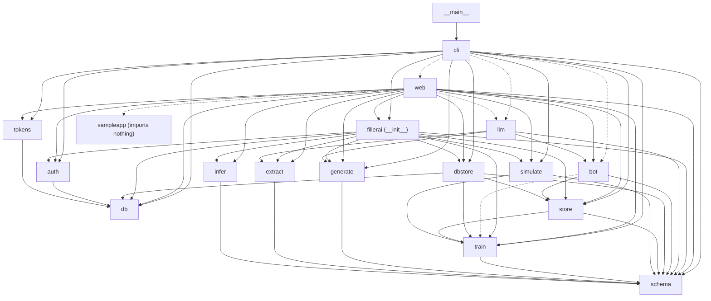
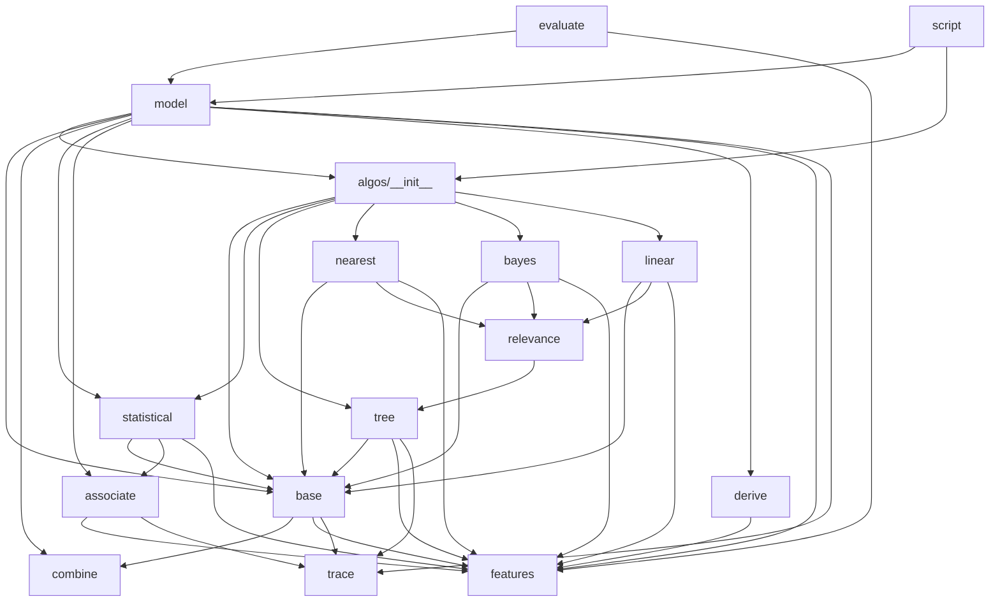

# Module reference

Every module in the `fillerai` package: what it is responsible for, what it
exposes, what it imports from the rest of the package, and what somebody
changing it needs to know first. [architecture.md](../architecture.md) says
why the pieces are shaped the way they are; this is the index you want open
beside the code.

This reflects version 0.15.0. The import lists were taken from the source
with `ast`, not written from memory: "imports" means a module-scope relative
import, and "imports lazily" means one inside a function body. Signatures are
abridged where the full one adds nothing; keyword-only markers are kept.

## Contents

1. [The dependency graph](#1-the-dependency-graph)
2. [The library API: `fillerai/__init__.py`](#2-the-library-api-fillerai__init__py)
3. [Top-level modules](#3-top-level-modules)
4. [`extract/`](#4-extract)
5. [`generate/`](#5-generate)
6. [`train/`](#6-train)
7. [`train/algos/`](#7-trainalgos)
8. [`simulate/`](#8-simulate)
9. [`bot/`](#9-bot)
10. [`llm/`](#10-llm)
11. [`web/` and `web/static/`](#11-web-and-webstatic)
12. [`sampleapp/`](#12-sampleapp)
13. [Rules a change must respect](#13-rules-a-change-must-respect)
14. [Tests](#14-tests)
15. [Where things live](#15-where-things-live)

---

## 1. The dependency graph

Edges between subpackages and top-level modules. A solid arrow is an import
at module scope; a dotted arrow is an import inside a function, which is how
the CLI and the web server reach `llm/` without crossing the fence (§13), and
how `web/` starts `sampleapp/` without the reverse ever being true.
`fillerai` is `fillerai/__init__.py`; `cli` and `web` import names from it
(`__version__`, `extract_html`, `extract_spec`).



Three things the graph says that are easy to miss:

- **`store` imports `train`** (for `AutofillModel`, to save and load models),
  so importing the library, or anything that imports it — `dbstore`,
  `bot` — pulls in the whole training package.
- **`schema` imports nothing**, and every stage points at it and at nothing
  upstream of it. `generate` does not see `train`; `train` does not see
  `extract` or `generate`. `simulate` sees `train` because it runs a model.
- **Nothing points at `llm`** except with a dotted arrow. `llm` itself is free
  to import the core, and does.

Inside `train/`, the same derivation gives this:



`schema` edges are left off this one; `model`, `script`, `derive`,
`features` and `algos/base` all import it.

---

## 2. The library API: `fillerai/__init__.py`

The package root re-exports the pieces a Python caller needs and adds three
convenience wrappers. Everything in `__all__`:

| Name | From | What it is |
|---|---|---|
| `__version__` | here | `"0.15.1"`; must match `pyproject.toml` |
| `SCHEMA_VERSION` | `schema` | `"1.0"`, the schema format version |
| `FormSchema`, `Screen`, `Field`, `Option`, `Constraints` | `schema` | the schema dataclasses |
| `extract_html(path, name=None) -> FormSchema` | here | `html_form.extract_file` then `infer` |
| `extract_spec(path) -> FormSchema` | here | `spec.load_file` then `infer` |
| `infer(schema)`, `infer_field(field)` | `infer` | fill in semantic types, in place |
| `generate(schema, count=10, seed=None, blank_rate=0.12, safe_identifiers=True, include_persona=False) -> Dataset` | here | wraps `generate.dataset.generate` with an `Options` built from keywords |
| `Dataset`, `Options` | `generate.dataset` | the records plus their schema; the generation knobs |
| `validate(schema, records) -> list[str]` | `generate.dataset` | records against the schema's own constraints |
| `coherence_report(schema, records) -> list[str]` | `generate.dataset` | the cross-field promises the generator makes |
| `train(schema, records, holdout=0.25, seed=None, algorithm="statistical") -> AutofillModel` | here | wraps `train.model.train`; for tuning or a trace build a `TrainOptions` and call `fillerai.train.train` |
| `AutofillModel`, `Prediction`, `TrainOptions` | `train.model` | the model, one field's answer, the training knobs |
| `Trace` | `train.trace` | a live log a training run writes to |
| `algos` | `train.algos` | the engine registry: `algos.names()`, `algos.get(name)`, `algos.DEFAULT` |
| `evaluate(model, records, seeds=3, threshold=0.7) -> Report` | `train.evaluate` | fill held-out records from their own seed fields and score them |
| `Report` | `train.evaluate` | accuracy, coverage, per-field scores, `headline()` |
| `suggest_seed_fields(model, count=3) -> list[str]` | `train.evaluate` | the fields worth typing first |
| `simulate(model, typed=None, *, case=None, threshold=0.7, effort=DEFAULT_EFFORT) -> Run` | `simulate.run.run` | one costed fill |
| `simulate_many(model, cases, seeds, *, threshold, effort) -> Sweep` | `simulate.run.sweep` | the same over many cases |
| `Run`, `Savings`, `Score`, `Sweep` | `simulate.run` | results of the above |
| `Store`, `Entry` | `store` | the library in a directory, and one entry in it |
| `DatabaseStore`, `import_store` | `dbstore` | the library in the database; copy a directory into it |
| `Database`, `DatabaseError`, `connect_database` | `db` | `connect_database` is `db.connect` renamed |
| `Auth`, `AuthError`, `User` | `auth` | accounts and sessions |

Not exported from the root, though public in their own modules: `layout`,
`Effort` and `spell_out` (`fillerai.simulate`), `Profile`, `Combiner`,
`script` and `split_records` (`fillerai.train`), `Tokens` (`fillerai.tokens`),
everything in `fillerai.bot`, and anything in `fillerai.llm` (which must stay
that way — see §13).

A worked example, run from the repository root against 0.15.0 with the
output it printed:

```python
import tempfile
from fillerai import (Store, extract_spec, generate, train, validate,
                      evaluate, suggest_seed_fields, simulate, simulate_many)

schema = extract_spec("examples/auto_insurance_quote.fields.json")
dataset = generate(schema, count=400, seed=42)
print(len(dataset.records), "records;", len(validate(schema, dataset.records)), "problems")

model = train(schema, dataset.records, algorithm="forest", seed=1)
seeds = suggest_seed_fields(model, 3)
print("type first:", seeds)

unseen = generate(schema, count=50, seed=99).records
print(evaluate(model, unseen, seeds).headline())

case = unseen[0]
print(simulate(model, {n: case[n] for n in seeds}, case=case).headline())
print(simulate_many(model, unseen, seeds).headline())

store = Store(tempfile.mkdtemp())
src = store.save_schema(schema)
dat = store.save_dataset(dataset.records, parent=src.id)
mdl = store.save_model(model, parent=dat.id)
print([e.kind for e in store.lineage(mdl.id)])
```

```
400 records; 0 problems
type first: ['license_state', 'rental_reimbursement', 'coverage_tier']
from 3 field(s) across 50 records: filled 18% of the remaining 2372 at 92% accuracy; 532 had no answer to give
3 typed, 10 filled, 41 left to type: 2m 33s against 2m 59s by hand, 15% less; 8 of 8 filled values matched the case
over 50 forms, typing 3 field(s) each: 9 of 51 fields filled at 92% accuracy, 2m 38s a form against 3m 00s by hand (12% less)
['schema', 'dataset', 'model']
```

It takes about seven seconds; the seeds make it repeat exactly. Run it with
the repository on `PYTHONPATH` (or after `pip install -e .`).

---

## 3. Top-level modules

### `schema.py` — the contract

The versioned dataclass tree every stage reads: `FormSchema` → `Screen`,
`Field` → `Option`, `Constraints`, `Derived`. Serialised as JSON.

- `SCHEMA_VERSION = "1.0"`; `SEMANTIC_TYPES` (the 50-odd meanings a field
  can have); `DATA_TYPES`.
- `FormSchema.from_dict / from_json / to_dict / to_json`; `.field(name)`,
  `.fields_on(screen_id)`, `.groups()`.
- `Derived.key(values)` and `.lookup(values)` — a declared rule's table,
  keyed on source values joined with `|`, lower-cased and stripped.

**Imports:** nothing from the package.

**Before changing it:** a breaking change bumps `SCHEMA_VERSION`, and
`from_dict` refuses a different major version. Every `from_dict` ignores
unknown keys, so an optional key is additive. `Field.name` is the join key
across schema, dataset, model, run and bot template. A new semantic type
needs a member of `SEMANTIC_TYPES`, a rule in `infer.py` if it should be
recognised, and a renderer in `generate/render.py`.

### `infer.py` — what a field means

Assigns `semantic_type`, `data_type`, `confidence` and `evidence` from ranked
signals (`WEIGHT_AUTOCOMPLETE = 0.97` down to `WEIGHT_WEAK = 0.55`).

- `infer_field(field) -> Field`, `infer(schema) -> FormSchema` — both work in
  place and return their argument.
- `RULES` is ordered most-specific first; `REFINES` says which specific type
  refines which generic one.

**Imports:** `schema`.

**Before changing it:** the order of `RULES` is behaviour — "date of birth"
must settle before the generic "date" rule is reached.

### `store.py` — the library in a directory

Every artefact a run produced, with a `parent` pointing at what it was made
from. One folder per kind, two files per entry (metadata, payload).

- `KINDS = ("source", "schema", "dataset", "model", "script", "template")`,
  id prefixes `src sch dat mdl scr tpl`. `new_id(kind)`, `kind_of(entry_id)`.
- `Entry` — `id, kind, name, created, parent, meta, bytes`.
- `Store(root)`, `Store.default()` (`$FILLERAI_HOME` or `./.fillerai`).
  `put`, `get`, `payload`, `has`, `list(kind=None, parent=None, limit=None)`,
  `children`, `lineage`, `descendants`, `delete(entry_id, cascade=False)`,
  `prune(keep=50)`, `rename`, `clear`, `totals`, `size`.
- Typed helpers: `save_source/schema/dataset/model/script` and
  `load_schema/records/model/script`.
- `StoreError`; `summarise(entries)`.

**Imports:** `schema`, `train.model` (`AutofillModel`).

**Before changing it:** `DatabaseStore` must keep the same method names and
the same `Entry`; the web server holds either without knowing which, and
`tests/test_dbstore.py` runs the lineage tests against both. Ids are checked
against `_ID` before they touch a path.

### `db.py` — the database, and the interface a backend meets

SQLite through a thin `Database` class, so a Postgres backend is a subclass.

- `connect(url=None, *, library_root=None, migrate=True) -> Database`;
  `default_url(library_root=None)`. `URL_VARIABLE = "FILLERAI_DATABASE_URL"`,
  `DEFAULT_FILENAME = "fillerai.db"`.
- `Database`: `execute`, `query`, `one`, `count`, `transaction()` (context
  manager), `setting` / `remember`, `migrate`, `version`, `tables`,
  `describe`, `connection`, `close`. `SQLiteDatabase(path)` adds `dispose()`.
- `MIGRATIONS` — list of `(version, [statements])`; steps 1 and 2 exist.
- `dumps` / `loads` — JSON helpers used by `dbstore`.

**Imports:** nothing from the package.

**Before changing it:** callers write `?` placeholders. Never edit a shipped
migration step; append one. Connections are one per thread — the web server
is threaded and a SQLite connection is not shareable.

### `dbstore.py` — the same library, with an owner

`DatabaseStore(db, owner="")` implements `Store`'s interface over the `entries`
and `payloads` tables, with every row owned and each write in one
transaction. Adds `for_owner(owner)`, `root()` and `owners()` (for the admin
panel). `import_store(source, target, skip_existing=True)` copies a
directory library in with ids and lineage intact.

**Imports:** `db`, `schema`, `store` (`Entry`, `KINDS`, `StoreError`,
`kind_of`, `new_id`), `train.model`.

**Before changing it:** an entry is named by `(id, owner)`. Every query must
filter on owner; `tests/test_web_auth.py` checks that one person cannot reach
another's library.

### `auth.py` — people

Accounts, roles, password hashing and database-backed sessions.

- `hash_password`, `verify_password` (scrypt, PBKDF2 fallback; both verify),
  `check_password_quality`, `suggest_password(words=4)`.
- `User`, `Session`, `AuthError(message, status=400)`.
- `Auth(db)`: `create_user`, `bootstrap`, `authenticate`, `start_session`,
  `cookie_value`, `resolve(cookie_value)`, `end_session`,
  `end_sessions_for`, `set_password`, `set_role`, `set_active`,
  `set_display_name`, `delete_user`, `sweep`, `users`, `admins`, `find`, `get`.
- Constants: `ADMIN`, `USER`, `ROLES`, `COOKIE = "fillerai_session"`,
  `IDLE_HOURS = 12`, `MAX_HOURS = 168`, `MAX_FAILURES = 6`,
  `LOCKOUT_MINUTES = 15`.

**Imports:** `db`.

**Before changing it:** the last active administrator cannot be disabled,
demoted or deleted. `User.to_dict` never includes the hash or the failure
count. `delete_user` removes the user's library too.

### `tokens.py` — applications

Bearer tokens `flr_<id>_<secret>` for the `/v1` surface, stored as SHA-256.

- `Tokens(db)`: `issue(user_id, name="", *, days=None, model_id=None)`
  returns the record and the secret (shown once); `verify(presented)`,
  `touch`, `revoke`, `revoke_all`, `forget`, `list`, `get`, `find`, `count`.
- `ApiToken`, `TokenError`; `MAX_NAME = 60`, `MAX_TOKENS_PER_USER = 25`.

**Imports:** `db`.

**Before changing it:** a verification failure says nothing about why. A
token with `model_id` set may only reach that model (`rest.Caller.may_use`).

### `cli.py` and `__main__.py` — every command

`main(argv=None)` builds an `argparse` parser (`build_parser()`) and
dispatches to one `cmd_*` function per command: `extract`, `generate`,
`inspect`, `serve`, `train`, `algorithms`, `predict`, `evaluate`, `simulate`,
`check`, `bot`, `llm`, `propose-rules`, `apply-rules`, `library`, `users`,
`tokens`, `db`. `__main__.py` calls `cli.main`, so `python -m fillerai` and the
`fillerai` script are the same thing.

**Imports:** `fillerai` (root), `auth`, `db`, `dbstore`, `generate.dataset`,
`schema`, `simulate.effort`, `simulate.run`, `store`, `tokens`, `train`
(`algos`, `script`), `train.evaluate`, `train.model`, `train.trace`.
**Imports lazily:** `bot` (in `cmd_bot`, `_bot_chat`), `web` (in `cmd_serve`),
and `llm.*` (in `cmd_llm_status`, `_rules_client`, `cmd_propose_rules`,
`cmd_apply_rules`).

**Before changing it:** an `llm` import added at the top of this file is the
exact mistake `tests/test_llm_fence.py` exists to catch. Commands that read or
write the library use the directory `Store` (`--library`, else
`Store.default()`); only `db`, `users` and `tokens` open the database here,
and `serve` leaves that to `web.server`.

---

## 4. `extract/`

Structure only; meaning is `infer.py`'s job. `extract/__init__.py` is empty.

| Module | Responsibility | Public |
|---|---|---|
| `dom.py` | a minimal element tree over `html.parser`, so a control's enclosing `<label>`, `<fieldset>` or `aria-describedby` target can be found | `parse(html) -> Node`; `Node.walk / elements / ancestors / closest / get / has / classes / inner_text` |
| `html_form.py` | find controls, pair labels, group radios, read constraints and screens (`data-screen`, `data-step`, …) | `extract(html, name=None, source=None) -> FormSchema`, `extract_file(path, name=None)`, `slugify(text)` |
| `spec.py` | the compact JSON field spec, including `follows` / `when` / `otherwise` rules | `load(data, source=None) -> FormSchema`, `load_file(path)`; private `_derived_from_spec` |

**Imports:** `dom` imports nothing; `html_form` imports `dom` and `schema`;
`spec` imports `schema`.

**Before changing it:** `llm/rules.py` imports the private
`spec._derived_from_spec` so a proposed rule is parsed by the same code as a
hand-written one. Renaming or changing it changes the LLM validation gate.

---

## 5. `generate/`

Coherent synthetic records from a schema. `generate/__init__.py` is empty.

| Module | Responsibility | Public |
|---|---|---|
| `catalogs.py` | public reference data; geography as coherent `Place` tuples | `Place`, `PLACES`, name, street, company, job and diagnosis lists, `EMAIL_DOMAINS` |
| `persona.py` | one imaginary entity, filled in lazily as fields ask; one address per coherence group; safe identifier ranges | `Persona` (`address(group)`, `email()`, `phone(kind, group)`, `identifier(kind)`, `card(part)`, `related(key)`, `age`, …), `Address`, `Employment` |
| `render.py` | how one control receives a fact: option matching, date formats, `maxlength` | `render(field, persona, rng)`, `choose_option(field, wanted, rng)`, `party_key(field)`, `compatible_prefixes(field, gender)` |
| `dataset.py` | assembles records, resolves declared rules in dependency order, applies the blank rate, checks the result | `generate(schema, options=None) -> Dataset`, `Options`, `Dataset` (`to_json`, `to_ndjson`, `to_csv`, `render(fmt)`), `validate`, `coherence_report` |

**Imports:** `catalogs` imports nothing; `persona` imports `catalogs`;
`render` imports `catalogs`, `persona`, `schema`; `dataset` imports `persona`,
`render`, `schema` (and `catalogs`, `render.compatible_prefixes` lazily).

**Before changing it:** `safe_identifiers=True` is the default and must stay
so — SSNs above area 899, `555-01xx` phones, RFC 2606 email domains, test IIN
card numbers. `validate` and `coherence_report` are also the last stage of the
LLM rule gate (`llm/rules.check`), so a change to either changes which
proposed rules survive.

---

## 6. `train/`

A shared layer — profiling, verified rules, holdout, calibration, scoring —
around one selectable engine.

### `train/__init__.py`

Re-exports `train`, `TrainOptions`, `AutofillModel`, `Prediction`,
`Calibration`, `split_records`, `ACCEPT_ABOVE`, `MODEL_VERSION` (from
`model`); `evaluate`, `suggest_seed_fields`, `Report`, `FieldScore`
(`evaluate`); `Profile` (`features`); `Trace` (`trace`); `Algorithm`,
`Engine`, `Guess` (`algos`); `Combiner` (`algos.combine`); and the `algos`
and `script` modules.

### `features.py` — reading the columns

`normalise(value) -> str`, `column(records, name)`, `mask_of(text)`
(`CLM-004821` → `AAA-999999`), `dominant_mask`, `Profile` (fill rate,
distribution, modal value, whether the field is enumerable or `open`),
`profile_field`, `profile_all(schema, records)`, `words(text)`.
`MAX_DISTINCT = 500` is the line between enumerable and open.
**Imports:** `schema`.

### `associate.py` — what one field says about another

Goodman and Kruskal's lambda, leave-one-out, against a shuffled baseline.
`Link` (one predictor → target table; `.conditional(value)`),
`learn_links(columns, profiles, min_lambda=0.1, max_predictors=6, trace=None)`,
`support_weight(rows)`, `coverage_score`. The expensive part of a
`statistical` fit. **Imports:** `features`, `trace`.

### `derive.py` — rules

Proposes rules from semantic types — `copy`, `join`, `initial`, `email`,
`age` — and keeps a rule only if it holds on the training data
(`MIN_ACCURACY = 0.9`, `MIN_SUPPORT = 5`). `Derivation.apply(observed)`,
`learn_derivations(schema, records, profiles, columns)`, `parse_date(text)`.
**Imports:** `schema`, `features`.

### `model.py` — the model

- `train(schema, records, options=None) -> AutofillModel` — the whole fit.
- `TrainOptions` — `algorithm="statistical"`, `holdout=0.25`, `seed`,
  `min_lambda`, `max_predictors`, `tuning` (per-algorithm knobs),
  `use_rules=True`, `learn_weights=True`, `trace`.
- `AutofillModel` — `predict(observed) -> dict[str, Prediction]`,
  `filled(observed, threshold=0.7)`, `predict_field`, `targets`,
  `field_report`, `provenance`, `links`, `to_json` / `from_json`.
- `Prediction` — `field, value, confidence, score, basis, because,
  alternatives, format`.
- `Calibration`, `split_records(records, options)`,
  `split_holdout(holdout, options)`.
- `MODEL_VERSION = "2.0"`, `ACCEPT_ABOVE = 0.7`, `USUAL_FLOOR = 0.25`.

**Imports:** `schema`, `algos` (package, `base.MARGINAL_WEIGHT`,
`combine.Combiner`, `statistical`), `associate`, `derive`, `features`,
`trace`.

**Before changing it:** confidence is calibrated on the holdout and never on
the rows it describes; the combiner is tuned on a slice off the front of the
holdout (`split_holdout`) so calibration never sees rows the weights were
chosen on. `from_dict` still reads 1.x models, which were fitted with
conditional tables. `ACCEPT_ABOVE` is imported by `simulate`, `web.rest`,
`web.server`, `cli` and `bot`.

### `evaluate.py` — scoring, and which fields to ask for

`evaluate(model, records, seeds=3, threshold=ACCEPT_ABOVE) -> Report`;
`Report` (`accuracy`, `accepted_accuracy`, `coverage`, `offered`,
`headline()`); `FieldScore`; `suggest_seed_fields(model, count=3)`.
**Imports:** `features`, `model`.

### `trace.py` — the live log

`Trace(echo=False)`: `log`, `step`, `detail`, `warn`, `done`, `expect`,
`finish(failure=None)`, `since(cursor)`, `progress`, `elapsed`. A lock
guards appends because the web UI fits on a worker thread and reads from
request threads. `SILENT` discards; `resolve(trace)` returns the trace or
`SILENT`, so fitting code never checks for `None`. **Imports:** nothing.

### `script.py` — the run as code

`recipe(options)` (the engine's steps in words), `command(options, …)` (the
equivalent CLI line), `script(options, schema=None, …, seeds=None)` (runnable
Python using only the public API, seed included). Generated from the same
`TrainOptions` the run used. **Imports:** `schema`, `algos`, `model`.

---

## 7. `train/algos/`

The selectable engines. Importing the package registers them, in the order
the UI's picker shows them.

| Module | Public | Notes |
|---|---|---|
| `__init__.py` | `Algorithm`, `Ballot`, `Engine`, `FitContext`, `Guess`, `get`, `names`, `all_algorithms`, `register`, `DEFAULT = "statistical"` | `from . import statistical, tree, nearest, bayes, linear` is what registers them |
| `base.py` | the `Engine` interface (`guess`, `targets`, `sources`, `strength`, `reach`, `explain`, `summary`, `to_dict` / `from_dict`), `Algorithm`, `FitContext`, `Guess`, `Ballot`, the registry, `tuning(context, key, default)`, `ranked`, `normalised`, `progress_every`, `MARGINAL_WEIGHT = 0.2` | imports `schema`, `combine`, `features`, `trace` |
| `statistical.py` | `StatisticalEngine`, `fit`, `links_from` | conditional tables by weighted vote; imports `base`, `associate`, `features` |
| `tree.py` | `TreeEngine` (`drawn(name)`), `Tree`, `Node`, `fit_tree`, `fit_forest` | registers both `tree` and `forest`; imports `base`, `features`, `trace` |
| `nearest.py` | `NearestEngine`, `fit` | stores a bounded sample of rows (`MAX_ROWS = 600`); imports `base`, `relevance`, `features` |
| `bayes.py` | `BayesEngine`, `fit` | imports `base`, `relevance`, `features` |
| `linear.py` | `LinearEngine`, `Weights`, `fit`, `bucket_of`, `hashable` | softmax over one-hot and hashed values; imports `base`, `relevance`, `features` |
| `relevance.py` | `table(columns, usable, keep=8, …)` | one pass of gain ratio; imports the private `tree._gain_ratio` |
| `combine.py` | `Combiner`, `fit(votes, seed=None)`, `HEURISTIC`, `support_share`, `recording()` | learned vote weights; imports nothing |

**Adding an engine:** one module that defines an `Engine` subclass and a
`fit(context)`, ends with `ALGORITHM = register(Algorithm(...))`, and is added
to the import line in `algos/__init__.py`. Nothing above the package changes.
`tests/test_algos.py` runs its contract tests over the registry, so the new
engine is covered by them without being named.

**Before changing it:** an engine is fitted per target field and must answer
from any subset of the other fields, including almost none. `nearest` is the
one engine whose saved model contains training rows. `relevance` depends on
`tree._gain_ratio`; changing that function's signature breaks `nearest`,
`bayes` and `linear` as well as `tree`.

---

## 8. `simulate/`

The model against a form it has not seen, costed.

| Module | Responsibility | Public |
|---|---|---|
| `__init__.py` | re-exports all of the below | |
| `effort.py` | every assumption behind a saving, in one frozen dataclass | `Effort` (`type_cost`, `review_cost`, `correct_cost`, `assumptions()`), `DEFAULT_EFFORT`, `spell_out(seconds)` |
| `form.py` | the form rebuilt from the schema, never from the pasted markup | `layout(schema) -> Layout`; `Layout`, `Page`, `Section`, `Control` |
| `run.py` | one fill, and many | `run(model, typed=None, *, case=None, threshold=ACCEPT_ABOVE, effort=DEFAULT_EFFORT) -> Run`; `sweep(model, cases, seeds, *, threshold, effort) -> Sweep`; `Run`, `Cell`, `Savings`, `Score`, `Sweep`; cell states `TYPED`, `FILLED`, `SUGGESTED`, `YOURS` |

**Imports:** `effort` imports nothing; `form` imports `schema`; `run` imports
`schema`, `effort`, `form`, `train.model` (`ACCEPT_ABOVE`, `AutofillModel`)
and `train.features`.

**Before changing it:** `run` is a pure function of model, typed values and
case; the UI calls it on every keystroke and the CLI once per record, and the
two must not diverge. Review of every filled value and correction of the
wrong ones are charged against the saving. The constants in `effort.py` are
the ones [assumptions.md](../assumptions.md) §4 describes.

---

## 9. `bot/`

Bot Builder: templates, and a conversation that fills them. The contract is
[bot-builder.md](../bot-builder.md).

| Module | Responsibility | Public |
|---|---|---|
| `__init__.py` | re-exports, plus a model-backed completer | `take_turn`, `BotError`, `Reader`, `Completer`, `Template`, `TemplateField`, `TemplateError`, `from_schema`, `Found`, `Problem`, `Reading`; `model_completer(load, threshold=None)` |
| `template.py` | a template: key, fields, examples, aliases, linked model; kept in the library as kind `template` | `Template`, `TemplateField`, `TemplateError`, `from_schema(schema, key=None, fields=None)`, `starters()`, `save`, `listed`, `load`, `find`, `remove`; `TEMPLATE_VERSION = "1.0"` |
| `understand.py` | the local reader: which template, which values | `read(templates, active, text, *, expects=None, last_field=None) -> Reading`, `score`, `rank`, `decide`, `read_values`, `accept(field, raw)`, `action_phrase`, `plain` |
| `conversation.py` | one turn as a pure function of input and state | `take_turn(templates, request, *, reader=None, complete=None) -> dict`, `read_state`, `read_input`, `State`, `Turn`, `BotError(message, code, status)`; `STATE_VERSION = 1` |
| `starters/` | bundled templates: `address_change`, `document_request` | shipped as package data |

**Imports:** `template` imports `schema`, `store` (`StoreError`);
`understand` imports `template`; `conversation` imports `template` and
`understand`; `__init__` imports all three and, lazily in `model_completer`,
`train.model.ACCEPT_ABOVE`.

**Before changing it:** the service keeps no conversation; state travels in
the request and is re-checked by `read_state` every turn because it has been
through a browser. `accept()` is the gate every value passes, typed or
model-read; `llm/understand.py` depends on it. Nothing in `bot/` may import
`llm/` — the reader is passed in as a `Reader` callable.

---

## 10. `llm/`

The optional language-model features, behind the import fence (§13). Off by
default; nothing here reads the environment at import time.

| Module | Responsibility | Public |
|---|---|---|
| `__init__.py` | re-exports | `Client`, `Reply`, `ReplyError`, `Settings`, `ConfigError`, `Estimate`, `SpendRefused`, `Provider`, `strict_ready`, the five `Transport` classes, `TransportError`; modules `client`, `config`, `cost`, `prompts`, `providers`, `rules`, `transport` |
| `providers.py` | the only module that knows a service's name: headers, paths, request and reply shapes | `Provider`, `Anthropic`, `OpenAI`, `Reply`, `ReplyError`, `get(name)`, `for_model(model)`, `for_response(response)`, `strict_ready(schema)`, `PROVIDERS`, `DEFAULT` |
| `config.py` | key, provider and per-task model, from the environment | `Settings.resolve(task, *, model=None, provider=None, environ=None)`, `.redacted()`, `.require_key()`; `choose_provider`; `ConfigError`; `TASKS = ("rules", "typing", "chat")`; `FILLERAI_LLM_*` variable names |
| `transport.py` | the only module that opens a socket | `Transport`, `UrllibTransport`, `SdkTransport`, `OpenAiSdkTransport`, `RecordedTransport` (`from_path`), `for_settings(settings)`, `sdk_for`, `digest(request)`, `post_form(...)`, `TransportError` |
| `client.py` | build a request, read a reply; no network | `Client(settings, transport=None)`: `build`, `ask`, `read` |
| `prompts.py` | every prompt and output schema | `compact_schema`, `RULES_SYSTEM`, `RULES_OUTPUT_SCHEMA`, `rules_user`, `rules_budget` |
| `cost.py` | the estimate printed before a call | `tokens(text)`, `estimate(model, prompt, expected_output_tokens) -> Estimate`, `enforce(est, ceiling)`, `SpendRefused`, `PRICES` |
| `rules.py` | propose a form's declared rules, then disbelieve them | `propose(schema, *, client, settings, sample, seed, max_spend, size) -> Proposals`, `check`, `apply(spec, proposals)`, `with_rules`, `parse`, `estimate`, `targets`, `batches`; `Proposal`, `Verdict`, `Proposals` |
| `understand.py` | read a chat phrase with a model, for `serve --bot-llm` | `reader(settings, *, client=None)` returns a `bot` `Reader`; `read_answer`, `describe`, `user_prompt` |
| `transcribe.py` | recorded speech to text with an OpenAI key, for `serve --bot-transcribe` | `transcriber(environ=None, *, post=None)`, `openai_key`, `TranscribeError` |

**Imports:** `providers` and `cost` import nothing; `config` imports
`providers`; `transport` imports `config`; `client` imports `config`,
`providers`, `transport`; `prompts` imports `schema`; `rules` imports
`client`, `config`, `cost`, `prompts`, `schema`, `generate.dataset` and
`extract.spec._derived_from_spec`; `understand` imports `client`, `config`,
`bot` (`understand`) and `bot.template`; `transcribe` imports `config`,
`providers`, `transport`. `__init__` does not import `understand` or
`transcribe`; the server imports them by module path.

**Before changing it:**

- A prompt edit changes the request digest, and `RecordedTransport` raises on
  a request it has not seen, so the fixtures in `tests/fixtures/llm/` must be
  re-recorded with `livetests/record.py` (or edited by hand) in the same
  change.
- The key is only ever shown through `Settings.redacted()` — four characters.
- `transcribe` never sends an Anthropic key to OpenAI.
- `propose` returns proposals; `apply` is a separate step with a person in
  between.

---

## 11. `web/` and `web/static/`

One `ThreadingHTTPServer` serving two surfaces. Every route is listed in
[http-api.md](http-api.md).

### `web/__init__.py`

Re-exports `create_server` and `serve` from `server`.

### `web/server.py` — the UI's `/api`, and the routing for both surfaces

- `serve(host="127.0.0.1", port=8000, open_browser=False, verbose=False,
  library_path=None, database=None, accounts=True, cors_origins=None,
  bot_llm=None, bot_transcribe=None, sample_app=True, sample_port=8100,
  sample_user=None) -> int` — what `fillerai serve` calls.
- `create_server(host, port)`, `open_database(url=None, *, accounts=True)`,
  `close_database()`, `use_bot_llm(on)`, `use_bot_transcribe(on)`,
  `start_sample_app(host, fillerai_port, port=8100, username=None)`.
- `Handler` — `do_GET`, `do_POST`, `do_OPTIONS`; `/v1/...` goes to
  `rest_dispatch`, `/api/...` to `ROUTES` (`Route(handler, needs)` where
  `needs` is `""`, `"user"` or `"admin"`, checked in one place).
- One `api_*` function per `/api` endpoint, each taking the JSON payload and
  returning a dict. Request state: `Context` in a `ContextVar`, read with
  `context()`, `current_user()`, `require_user()`; `library()` returns the
  `Store` or the caller's `DatabaseStore`.
- `Run` — a training run on a worker thread, with its `Trace`.
- Process-wide state lives in module globals: `LIBRARY`, `DATABASE`, `AUTH`,
  `KEYRING`, `BOT_LLM`, `BOT_TRANSCRIBE`, `CORS_ALLOW`, and the model and run
  caches.

**Imports:** `fillerai` (root), `auth`, `bot` and `bot.template`, `db`,
`dbstore`, `extract`, `generate.dataset`, `infer`, `schema`,
`simulate.effort`, `simulate.form`, `simulate.run`, `store`, `tokens`,
`train` (`algos`, `script`), `train.evaluate`, `train.model`, `train.trace`,
`web.rest`, `web.botrest`, `web.keyring`. **Imports lazily:** `llm.providers`,
`llm.config`, `llm.client`, `llm.cost`, `llm.transport`, `llm.rules`,
`llm.understand`, `llm.transcribe`, and `sampleapp.app`.

**Before changing it:**

- **A background thread must carry the request's user.** A new thread starts
  with an empty `ContextVar`, so `library()` there returns the unowned
  library. `Run.start` reads `context()` on the request thread and sets a
  fresh `Context(user=..., session=...)` inside the worker; do the same for
  any new worker, and do not hand the worker the request's own `Context`
  object (it could set a cookie on a response that has already gone).
- `Handler._rest` installs an empty `Context` before `/v1`, so the cookie is
  never read there.
- Deleting a model entry must call `rest.forget(entry_id)`, or `/v1` keeps
  serving the cached copy.
- `close_database()` puts the globals back; tests rely on it.

### `web/rest.py` — `/v1` models

`ENDPOINTS` of `Endpoint(method, pattern, handler, needs_token=True)`;
handlers `health`, `models`, `model`, `suggest`, `fill`, `batch`, each
`(caller, params, body) -> dict`. `Caller` (user, library, token;
`may_use(entry_id)`), `RestError(message, status, code)`, `Response`,
`match(method, path)`, `bearer(header)`, `load(caller, entry_id)`,
`forget(entry_id=None)`. Models are cached per `(owner, entry id)`,
`MAX_CACHED = 8`.

**Imports:** `fillerai` (`__version__`), `store`, `tokens` (`ApiToken`),
`train.evaluate`, `train.model`. **Imports lazily:** `web.botrest` (it
imports `rest` at module scope, so the reverse import has to wait).

**Before changing it:** no modelling here — it calls the same `predict()` the
UI does. `/v1` is versioned; a change to a response shape is a change to the
version.

### `web/botrest.py` — `/v1` bot

`ENDPOINTS`: `GET /v1/templates` (list), `POST /v1/templates` (save),
`GET /v1/templates/{key}`, `POST /v1/templates/{key}/delete`,
`POST /v1/bot/turn` and `POST /v1/bot/transcribe`; handlers `templates`,
`template`, `save_template`, `delete_template`, `turn`, `transcribe`. `run_turn(store, available, body, *,
load_model, reader)` and `run_transcribe(transcriber, body)` are shared with
the UI's `/api/bot/turn` and `/api/bot/transcribe`. `READER` and
`TRANSCRIBER` are hooks the server replaces (`use_bot_llm`,
`use_bot_transcribe`); by default they return `None`.

**Imports:** `bot`, `bot.template`, `store`, `web.rest`. **Imports lazily:**
`llm.transcribe` (for `TranscribeError`).

### `web/keyring.py` — keys typed into the UI

`Keyring`: `set_key(user, provider, key)`, `keys`, `typed`, `preference`,
`set_preference`, `forget(user)`, `clear()`; `Preference`;
`SINGLE_USER = ""`. In memory, keyed by user id, written nowhere.
**Imports:** nothing.

### `web/static/`

Served as files, no build step; shipped through `package-data` in
`pyproject.toml`.

| File | What it is |
|---|---|
| `index.html`, `app.js`, `styles.css` | the UI; every button is one POST to `/api` |
| `login.html`, `login.js` | the one page a signed-out browser may load |
| `client/fillerai.js` | the browser client, one ES module: `FillerAI`, `FillerAIError`, `FormBinder`, `BotChat`, `SpeechInput`, `RecordedSpeechInput`, `ChatWidget`, `changeCard`; served at `/client/fillerai.js` |
| `client/fillerai-chat.css`, `client/chat.html`, `client/demo.html`, `client/README.md` | the chat widget's styles, two demonstration pages, and the client's own readme |

---

## 12. `sampleapp/`

Northwind Mutual, a customer portal that uses the bot service the way an
outside application would. `fillerai serve` starts it on port 8100 unless
`--no-sample-app`; it also runs alone with `python -m fillerai.sampleapp
--fillerai http://localhost:8000 --token flr_...`.

- `app.py`: `Portal` (the application's own record and submit rules),
  `FillerAIService(base, token="", timeout=30.0)` (`templates`, `template`,
  `turn`, `transcribe`, `client_file`), `make_server(...)`, `main(argv=None)`,
  `Rejected`.
- `static/`: `index.html`, `app.js`, `style.css`.
- `__main__.py` calls `app.main`; `README.md` describes running it.

**Imports:** nothing from `fillerai`. `tests/test_sample_app.py` parses
`app.py` and fails on any `fillerai` or relative import. Everything it needs
comes over HTTP from `/v1`, with the token kept on its server.

---

## 13. Rules a change must respect

The ones that are enforced by a test, and the one that is not:

- **The LLM import fence.** No module outside `fillerai/llm/` may import
  `fillerai.llm` at module scope. `tests/test_llm_fence.py` checks it three
  ways: a subprocess imports every module in `CORE_MODULES` and fails if any
  `fillerai.llm*` appears in `sys.modules`; a textual scan fails on any
  unindented `import`/`from` line containing `.llm` outside the package; and
  `pyproject.toml` must still say `dependencies = []` and list
  `"fillerai.llm"`. Put the import inside the function that needs it. The
  subprocess check only sees modules reachable from `CORE_MODULES`, so a new
  core module that nothing there imports should be added to that list.
- **`sampleapp` imports nothing from AIrForms** (`tests/test_sample_app.py`).
- **No runtime dependencies.** Standard library only, in the package and in
  the tests.
- **A new subpackage must be added to `packages` in `pyproject.toml`**, which
  is an explicit list, and non-Python files to `package-data`. Nothing tests
  this; a missing entry only shows up in an installed copy.
- **Worker threads carry the request's user** (§11), or their output lands in
  the wrong library.
- **Format versions:** `SCHEMA_VERSION` (`schema.py`), `MODEL_VERSION`
  (`train/model.py`), `TEMPLATE_VERSION` (`bot/template.py`),
  `STATE_VERSION` (`bot/conversation.py`), and the `/v1` prefix. Shipped
  migrations in `db.MIGRATIONS` are never edited.

The full list of invariants is [architecture.md](../architecture.md) §9.

---

## 14. Tests

`python -m unittest discover -s tests` — 868 tests, offline, standard library
only, about 80 seconds. Several start a real HTTP server on an ephemeral
port.

| File | Tests | Covers |
|---|---|---|
| `test_fillerai.py` | 91 | `extract/dom`, `html_form`, `spec`, `infer`, `generate/` (persona, render, dataset, gender and party coherence), the schema format, and the extract/generate CLI |
| `test_rules.py` | 21 | declared `follows`/`when` rules: reading them from a spec, applying them in generation, a wrong rule, and the bundled forms built on them |
| `test_train.py` | 84 | `train/features`, `associate`, `derive`, `model`, calibration, `evaluate`, the bundled example, library and CLI round trips, loading 1.x models, run records, `script` |
| `test_algos.py` | 45 | the engine registry and a contract every registered engine must meet, plus engine-specific checks for tree, nearest, bayes, linear and `reach` |
| `test_combine.py` | 23 | `train/algos/combine`: which rows the learned weights may see, and that they are kept only when they beat the hand-picked ones |
| `test_trace.py` | 13 | `train/trace`: the cursor under concurrent appends |
| `test_simulate.py` | 36 | `simulate/`: layout, effort constants, runs, savings, sweeps, the stylesheet, the CLI |
| `test_store.py` | 29 | `store`: lineage, cascading delete, prune, unsafe ids |
| `test_db.py` | 20 | `db`: parameter translation, idempotent migrations, rollback |
| `test_dbstore.py` | 25 | `dbstore`: the `test_store` lineage tests against the database, owners, atomic writes, `import_store` |
| `test_auth.py` | 38 | `auth`: hashing, lockout, sessions, forged cookies, the last administrator; the `users` and `db` commands |
| `test_tokens.py` | 18 | `tokens`: issue, verify, revoke, and revocation with the account |
| `test_web.py` | 77 | `web/server` `/api` without accounts: static files, extract, generate, export, train (including watched runs), simulate, library, request limits |
| `test_web_auth.py` | 36 | `web/server` with accounts: login, CSRF, roles, one library per person |
| `test_web_llm.py` | 29 | `/api/llm/*`: a typed key never comes back in a reply; propose-rules over HTTP against a recording |
| `test_rest.py` | 50 | `web/rest`: `/v1` over a socket, tokens not cookies, pinned tokens, CORS, ids that survive a restart |
| `test_bot.py` | 46 | `bot/`: templates, the local reader, turns and state, against `docs/bot-builder.md` |
| `test_bot_rest.py` | 18 | `web/botrest` and `/api/bot`: token scope, refusal codes, the served client, the UI running the same turn |
| `test_sample_app.py` | 11 | `sampleapp` against a real AIrForms: the token stays server-side, forms come from templates, submit, and the no-import rule |
| `test_llm_fence.py` | 4 | the import fence and the empty dependency list (§13) |
| `test_llm_client.py` | 31 | `llm/client` and `transport`: request building, reply reading, refusals and truncations that arrive as successes, a stubbed opener |
| `test_llm_providers.py` | 44 | `llm/providers` and `config`: both wire formats, provider inference, the same rules reaching the same verdict through both readers |
| `test_llm_rules.py` | 34 | `llm/rules`: every stage of the validation gate, offline against recordings |
| `test_llm_batching.py` | 24 | `llm/rules` batching and output budgets for forms too large for one request |
| `test_llm_understand.py` | 8 | `llm/understand`: a model's reading believed only as far as `accept()` allows, and falling back to the local reader |
| `test_llm_transcribe.py` | 13 | `llm/transcribe`: which key is used, the multipart upload against a local server, off unless turned on |

`tests/fixtures/llm/` holds the recorded exchanges that `RecordedTransport`
replays.

### `livetests/`

Not run by `discover -s tests`, and not free to run.

- `test_rules_acceptance.py` — the acceptance gate for proposing rules from
  [llm-implementation-plan.md](../llm-implementation-plan.md): real calls to
  whichever provider the environment points at, measuring whether proposed
  rules move the saving on `claims_intake.html` without making the data
  incoherent. Skips unless opted in:
  `FILLERAI_LLM_LIVE=1 FILLERAI_LLM_KEY=... python -m unittest discover -s livetests`.
- `record.py` — re-records `tests/fixtures/llm/*.json` from a real call, one
  file per provider: `FILLERAI_LLM_KEY=... python livetests/record.py
  examples/member_enrollment.fields.json`. Run it after a prompt change and
  commit the new recording.

---

## 15. Where things live

The tree from [architecture.md](../architecture.md) §10, one level deeper.

```
fillerai/
  __init__.py          the library API (§2)
  __main__.py          python -m fillerai -> cli.main
  schema.py            the versioned field-schema contract
  infer.py             semantic type from ranked evidence
  cli.py               every command
  store.py             the library in a directory
  db.py                the database, and the interface a backend meets
  dbstore.py           the same library in the database, with an owner
  auth.py              users, passwords, roles and sessions
  tokens.py            bearer credentials for an application
  extract/             dom.py, html_form.py, spec.py
  generate/            catalogs.py, persona.py, render.py, dataset.py
  train/               features, associate, derive, model, evaluate,
                       trace, script
    algos/             base, statistical, tree (tree and forest), nearest,
                       bayes, linear, relevance, combine
  simulate/            effort.py, form.py, run.py
  bot/                 template, understand, conversation
    starters/          address_change, document_request (.template.json)
  llm/                 providers, config, transport, client, prompts,
                       cost, rules, understand, transcribe
                       (behind the import fence)
  web/
    server.py          the UI's /api, and the routing for both surfaces
    rest.py            the /v1 integration API
    botrest.py         the bot service on /v1
    keyring.py         API keys typed into the UI, in memory only
    static/            index.html, app.js, styles.css, login.*
    static/client/     fillerai.js, fillerai-chat.css, chat.html,
                       demo.html, README.md - the browser client
  sampleapp/           app.py, __main__.py, static/ (index.html, app.js,
                       style.css); imports nothing from AIrForms
examples/              one HTML form and four field specs
tests/                 868 tests, offline, no dependencies
  fixtures/llm/        recorded LLM exchanges
livetests/             the LLM acceptance gate and the fixture recorder
docs/                  the documentation; reference/ holds this file
```
